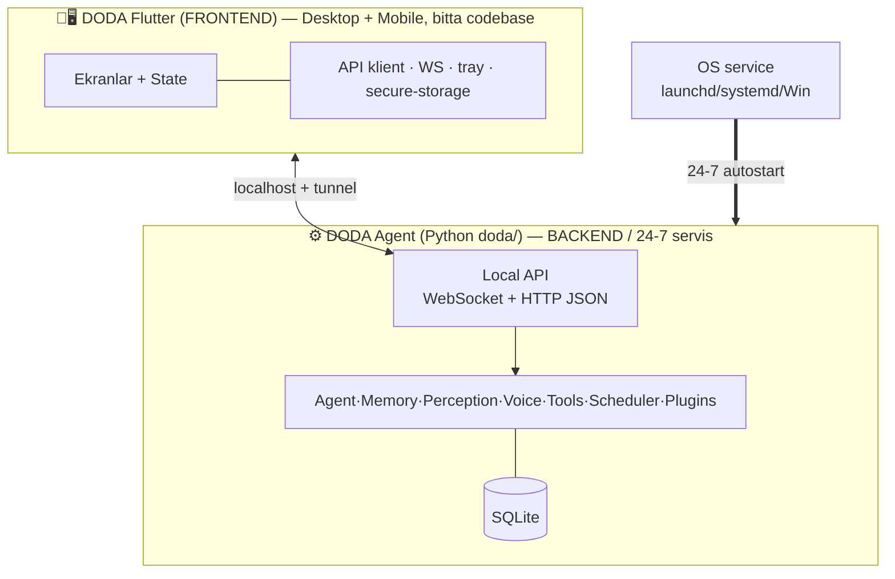

# DODA Desktop & Mobile — Arxitektura (Flutter + Python)

> ✅ **YAKUNIY QAROR: Flutter** (Desktop mac/win/linux **+** Mobile iOS/Android — bitta codebase)
> + **Python AI Engine** (backend). O'rnatiladigan: `DODA.dmg` / `DODA Setup.exe` / `.AppImage` / `.deb`.
> AI mantiq — [`../doda/ARCHITECTURE.md`](../doda/ARCHITECTURE.md). Oqim — [`../docs/DESKTOP.md`](../docs/DESKTOP.md).

---

## 1. Nega Flutter (yakuniy)

Oldin Tauri tavsiya qilinган edi, lekin foydalanuvchi **informed qaror** bilan **Flutter**ni tanladi:
- Foydalanuvchi **Flutter developer** (mahsuldorlik).
- Kelajакда **Android/iOS bir xil codebase** — desktop va mobil bitta.
- UI'ни web+mobile bilan **bir xil** ushlab turish.
- Professional, native, uzoq-muddat qo'llab-quvvatlash.

**Tradeoff (qabul qilinган):** mavjud web-UI (dashboard) qayta ishlatilmaydi — UI Dart'да quriladi.
**Yutuq:** bitta codebase desktop **+** mobil; native unum. Web-UI alohida web-klient bo'lib qoladi.

| | Electron | Tauri | **Flutter ✅** |
|---|:---:|:---:|:---:|
| Desktop mac/win/linux | ✅ | ✅ | ✅ |
| **Mobil (iOS/Android) bir codebase** | ❌ | 🟡 beta | ✅ **birinchi darajali** |
| Foydalanuvchi tajribasi | JS | Rust | **Dart (o'z sohasi)** |
| Native unum | 🟡 | ✅ | ✅ |
| Web-UI qayta ishlatish | ✅ | ✅ | ❌ (Dart'да qaytadan) |

---

## 2. Ikki mustaqil jarayon



- **Backend** — Python OS-service, boot autostart, UI'дан mustaqil 24/7 (headless mini-PC ham).
- **Frontend** — Flutter app + tray; login autostart; oyna yopilса → tray.
- **IPC** — WebSocket + HTTP (JSON), bitta API yuzasi barcha klient uchun.

---

## 3. Folder structure

```
(repo root)
├── doda/                    # 🧠 Python AI engine (BACKEND)
├── desktop/                 # 📱🖥️ Flutter app (FRONTEND — desktop + mobile)
│   ├── lib/
│   │   ├── main.dart
│   │   ├── core/            #   api-client, ipc (ws/http), models, di
│   │   ├── features/        #   chat/ memory/ tasks/ settings/ plugins/ vision/ logs/ developer/
│   │   ├── platform/        #   tray, autostart, notifications, secure_storage
│   │   └── shared/          #   theme (dark-teal), i18n (uz/ru/en), widgets
│   ├── macos/ windows/ linux/   #   desktop runnerlar
│   ├── android/ ios/            #   mobil runnerlar (kelajak, tayyor)
│   └── pubspec.yaml
├── packaging/               # 📦 Backend paketlash + OS service
│   ├── pyinstaller/         #   doda/ → sidecar binar (har OS)
│   └── services/{macos,windows,linux}
└── .github/workflows/       # 🚀 CI/CD (Flutter build + Python binar → installerlar)
```

---

## 4. Roadmap (Track B — Flutter)

| # | Bosqich | Definition of Done |
|---|---------|--------------------|
| **D1** | Flutter scaffold (desktop **+** mobil target) | `flutter run -d macos` oyna ochiladi |
| **D2** | API/IPC klient (WebSocket+HTTP) | Suhbat/holat/ovoz jonli oqadi |
| **D3** | Tray + lifecycle + autostart | Oyna yopilса Engine ishlaydi; login'да ochiladi |
| **D4** | Settings UI (camera/mic/speaker, API-keys, config) | Sozlamалар kod tegilmасдан o'zgaradi |
| **D5** | Backend paketlash (PyInstaller sidecar) + OS-service | Har OS'да o'rnatilib boot'да ishga tushadi |
| **D6** | Installerlar — DMG/MSI-EXE/AppImage/DEB (`flutter_distributor`/`msix`) | Har OS uchun o'rnatuvchi fayl |
| **D7** | Auto-update (imzo + feed) | Bir tugma bilan yangilanadi |
| **D8** | CI/CD (GitHub Actions matrix) | Tag → barcha installerlar Release'да |
| **D9** | Plugin Store UI | Plugin UI'дан o'rnatiladi |
| **D10** | Mobil (iOS/Android) — bir xil codebase | Telefon appи uy-server API'га ulanadi |

---

## 5. Texnik risklar
- **Python paketlash** (PyInstaller: dlib/opencv/whisper, har OS) — eng qiyin qism, framework'дан mustaqil. D5 spike.
- **Kod imzolash** — macOS notarization ($99/yil) + Windows sertifikat + iOS/Android store hisoblari (mobil). Byudjet/rejа qarori.
- **Flutter desktop installer tooling** — `flutter_distributor`/`msix` Electron/Tauri bundler'дан bir oz kam-yetuk; CI'да sinaladi.
