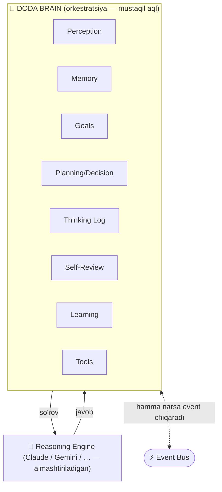
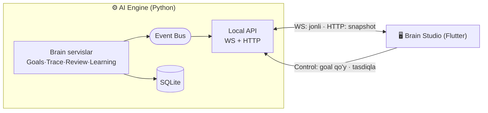
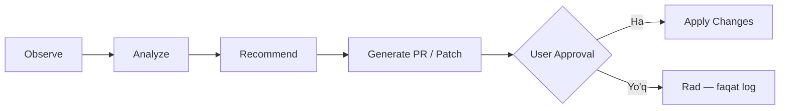

# DODA — Brain Studio & DODA Brain

> DODA — oddiy chatbot emas, **AI Brain**. Claude faqat **reasoning engine** (fikrlash
> vositasi); DODA esa uning ustida Memory/Planning/Goals/Vision/Voice/Scheduler/Plugins/
> Tools/Learning/Self-Review/Decision-Making'ni boshqaradigan **mustaqil aql**.
>
> **Brain Studio** — shu aqlning ichki holatini real vaqtда **kuzatish, tahlil qilish va
> boshqarish markazi** (cockpit).
>
> 🔒 **MAJBURIY XAVFSIZLIK QOIDASI:** DODA hech qачон **yashirin/avtomatik** o'zini o'zgartirmaydi.
> Barcha o'zgarishlar **foydalanuvchi tasdig'idan keyingina**. (Autonomy Boundary — §9.)

---

## 1. DODA Brain — konseptual qatlam



- **Claude ≠ DODA.** Claude — bitta komponent (LLMProvider, M2), almashtiriladigan.
- **DODA Brain** — kognitiv tsikl (M4) + Goals + Planning + Memory + Learning + Self-Review.
- **Brain Studio** shu aqlni **ko'rsatadi va boshqaradi** (yangi UI + backend servislar), lekin
  **yadroni o'zgartirmaydi** — u Event Bus'ning obunachisi + holat-servislar mijozi (Plugin-First/Event-Driven qoidasiga mos).

---

## 2. Brain Studio nima?

Uch vazifa: **Observe (kuzat) · Analyze (tahlil qil) · Control (boshqar).** Faqat monitor emas —
maqsad qo'yish, tavsiyalarni ko'rish/tasdiqlash, servislarni boshqarish markazi.

Ma'lumot **manbadan** keladi: har modul **event** chiqaradi (Event Bus) + **Observability/
Telemetry**ga yozadi + **holat-servislarni** yangilaydi. Brain Studio (Flutter) Local API'ning
**WebSocket** oqimiga ulanadi (jonli eventlar) va **HTTP** bilan holat-snapshot oladi.



**Muhim:** Brain Studio hech narsani "hisoblamaydi" — u faqat Engine chiqargan eventlar/holatni
ko'rsatadi. Butun mantiq backend'da (klientlar yupqa). Shu API telefon/webда ham ishlaydi.

---

## 3. Brain Studio panellari (real vaqtда yangilanadi)

| Panel | Manba (backend) |
|-------|-----------------|
| 🧠 **Current Goal** / Sub-Goals / Progress | Goal Service (§4.1) |
| 💭 **Current Task** | Agent kernel (aktiv task holati) |
| 📝 **Thinking Log** (DODA narratsiyasi) | Cognitive Trace (§4.2) — `thinking.*` eventlar |
| 📚 **Memory Search** (nima izlanyapti/topildi) | Memory (M3) — `memory.*` eventlar |
| 📝 **Active Conversation** | Conversation (M4) |
| 📷 **Vision** / 🎤 **Mic** / 🔊 **Speaker** status | Perception/Voice (M5/M8) — device holati |
| 🔌 **Active Plugins** / 🧰 **Active Tools** | Plugin/Tool registrlari (M6/M10) |
| 📅 **Scheduler** (kutilayotgan vazifalar) | Scheduler (M9) |
| ⚡ **Event Bus** (oqim tezligi/oxirgi eventlar) | Event Bus (M1) metrikasi |
| 📊 **Performance** · 🖥 **CPU** · 💾 **RAM** | Telemetry (M14) |
| 💰 **API Cost** · 📈 **Token Usage** | Cost/Token metrikasi (M2 hook → M14) |
| 📂 **Logs** | Observability (M1) |
| 🕒 **Event Timeline** | Events jadvali (§7) |
| 🔎 **Self-Review** natijalari + tavsiyalar | Self-Review (§4.3) |
| 🛠 **Recommendations / Improvements** | Self-Improvement (§4.4) — tasdiqlash bilan |
| 📈 **Learning** kunlik xulosalar | Learning (§4.5) |

**Diqqat:** har panel — mavjud modul chiqargan **event/holatning ko'rinishi** (yangi hisob-kitob emas).

---

## 4. Backend "Brain servislari" (yangi — application qatlamida `brain/`)

Bular **yangi modul-servislar** (core'ni o'zgartirmaydi). Har biri port ortida, Event Bus'ga
ulanган, SQLite'да holatли.

### 4.1 🎯 Goal Service
- **Model:** `Goal(id, title, status, progress, parent_id?)` — bitta **aktiv** goal + sub-goals.
- Oqim: `Current Goal → Sub-Goals → Progress → Completed`. Eventlar: `goal.created|updated|completed`.
- Brain Studio: ko'rsatadi **va** boshqaradi (foydalanuvchi goal qo'yadi/o'zgartiradi).
- Planning (M7) sub-goallarни shu servisда bajaradi.

### 4.2 💭 Cognitive Trace (Thinking Log)
- **DODA o'z ishini narratsiya qiladi** — Claude'ning ichki CoT'i EMAS (u ko'rinmaydi, bilamiz).
- Agent har qadamда `trace.step("...")` chaqiradi → `thinking.step` eventi + `trace` jadvali.
- Namuna: `Searching memory… → Found related project → Planning response → Choosing tool →
  Calling Claude API → Executing tool → Saving memory → Completed.`
- Foydalanuvchi uchun **tushunarli**; har qadam trace_id bilan bog'langan (Observability).

### 4.3 🔎 Self-Review Service
- Har javobдан **keyin** DODA o'z ishini baholaydi: **Response Quality · API Cost · Latency ·
  Errors · Memory Saved · Tool Success**.
- Natija: `review` yozuvi + `review.completed` eventi. Muammo topsa: **log + taklif** beradi.
- ⚠️ **Kodni o'zgartirmaydi** — faqat qayd etadi/tavsiya qiladi. (M13 AI Evaluation bilan bog'liq.)

### 4.4 🛠 Self-Improvement Service (boshqariladigan)
- DODA o'zini tahlil qiladi: **Kod sifati · TODO · Performance · Security · Documentation ·
  Dead Code · Duplicate Code**.
- ⛔ **HECH QACHON avtomatik o'zgartirmaydi.** Faqat quyidagi oqim (§9):

- Brain Studio — bu yerда foydalanuvchi tavsiya/patch'ни **ko'radi va tasdiqlaydi**.

### 4.5 📈 Learning Service
- **Kunlik** faoliyat tahlili: qaysi tool ko'p ishlatildi · qaysi promptlar yaxshi ishladi ·
  qaysi javoblar foydali · qaysi xatolar ko'p · memory qanday optimizatsiya kerak.
- Natija: **tavsiyalar** (avtomatik o'zgarish YO'Q) — Brain Studio'да ko'rinadi.

**Mavjud servislar** (Brain Studio surface qiladi): Memory, Perception, Voice, Scheduler,
Plugins, Tools, Telemetry (CPU/RAM/cost/token), Event Bus, Logs.

---

## 5. Ma'lumot modeli qo'shimchalari (DATABASE.md kengaytmasi)
- `goals(id, title, status, progress, parent_id, created_at, updated_at)`
- `thinking_steps(id, conversation_id, trace_id, step, created_at)` (yoki `events`da `thinking.*`)
- `reviews(id, conversation_id, quality, cost, latency_ms, errors, memory_saved, tool_success, created_at)`
- `recommendations(id, kind[review/learning/improvement], summary, detail, status[open/applied/rejected], created_at)`
- `improvements(id, recommendation_id, patch_ref, status[proposed/approved/rejected/applied], created_at)`

## 6. API + Event qo'shimchalari (API.md kengaytmasi)
- **HTTP:** `GET /api/v1/brain/state` (snapshot: goal/task/statuslar) · `GET /brain/timeline` ·
  `GET /brain/reviews` · `GET /brain/recommendations` · `GET/PUT /goals` (qo'y/steer) ·
  `POST /improvements/{id}/approve|reject`.
- **WS eventlar (jonli):** `thinking.step` · `goal.updated` · `task.changed` · `review.completed` ·
  `recommendation.created` · `timeline.event` · (+ mavjud `memory.*`/`tool.*`/telemetry).

---

## 7. Event Timeline
Har muhim hodisa `events` jadvalида + `timeline.event` oqimида. Brain Studio xronologik ko'rsatadi:
```
16:30  User Message  →  16:30  Memory Search  →  16:30  Planning  →
16:31  Claude Response  →  16:31  Tool Execution  →  16:31  Memory Save  →  ✅ Completed
```
Har element `trace_id` bilan — bitta so'rovni uchdan-uchgacha kuzatish.

---

## 8. UI layout (diagram)
To'liq ekran ta'rifi — [UI_GUIDE.md](UI_GUIDE.md) (Brain Studio bo'limi). Qisqacha panel-tarhi:
```
┌──────────────────────── BRAIN STUDIO ────────────────────────┐
│ 🧠 Current Goal ▸ Sub-Goals ▸ Progress    │ 💭 Thinking Log   │
│ 💭 Current Task                           │  Searching mem…   │
├───────────────────────────────────────────│  Planning…        │
│ 📚 Memory  📝 Conversation  📅 Scheduler  │  Calling Claude…  │
│ 📷Vision 🎤Mic 🔊Speaker 🔌Plugins 🧰Tools │  Saving memory…   │
├───────────────────────────────────────────┴───────────────────┤
│ 🕒 Event Timeline (xronologik oqim, trace_id bilan)           │
├──────────────┬──────────────┬──────────────┬──────────────────┤
│ 💰 Cost 📈Tok │ 🖥 CPU 💾 RAM │ ⚡ Event Bus │ 📂 Logs          │
├──────────────┴──────────────┴──────────────┴──────────────────┤
│ 🔎 Self-Review  |  📈 Learning  |  🛠 Recommendations [Approve]│
└───────────────────────────────────────────────────────────────┘
```

---

## 9. 🔒 Autonomy Boundary (majburiy xavfsizlik)

**DODA hech qачон yashirin/avtomatik o'zini o'zgartirmaydi.** Bu — qat'iy arxitektura chegarasi:

| DODA O'ZI qiladi (avtonom) | FAQAT tasdiq bilan |
|----------------------------|--------------------|
| Kuzatish, tahlil, **tavsiya** | Kod o'zgartirish |
| Thinking Log, Self-Review, Learning | Config/sozlama o'zgartirish (muhim) |
| Timeline, hisobotlar | Tashqi harakat (xabar yuborish, o'chirish) |
| Patch/PR **taklif** qilish | Patch/PR **qo'llash** |

- Self-Improvement natijasi — **taklif** (patch/PR), hech qачон to'g'ridan qo'llanmaydi.
- Barcha tasdiqlash Brain Studio'да, foydalanuvchi tomonidan. Rad etilsa — faqat log.
- Bu qoida [SECURITY.md](SECURITY.md) va DECISION_LOG (ADR) bilan mustahkamlanadi.

---

## 10. Arxitektura mosligi va roadmap

- **Yadro o'zgarmaydi.** Brain Studio + brain servislar **additiv**: yangi UI + yangi
  application-servislar (`brain/`) + Event Bus obunasi. 4 kengaytma nuqtasiga mos.
- **Scope-lock hurmat qilinadi:** bu yangi qobiliyat → [VERSION_PLAN.md](VERSION_PLAN.md)ga
  (v1.0'га EMAS). Bosqichli:
  - **v1.1 — Brain Studio (monitoring)** + Thinking Log + Goals + Self-Review asoslari
    (Event Bus + Telemetry + Agent tayyor bo'lгач).
  - **v2.0 — Self-Improvement (boshqariladigan PR-oqim) + Learning** (kunlik tahlil).
- Dizayn **hozir** tayyorlandi — shu sabab Agent (M4), Planning (M7), Telemetry (M14) shu
  eventlar/traceларни chiqaradigan qilib quriladi (keyin refaktor shart bo'lmaydi).
