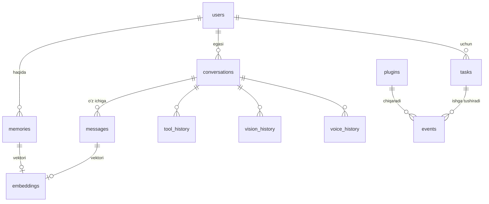

# DODA — Database Design

> **Backend:** SQLite (hozir) → PostgreSQL (kelajak, ko'p-qurilma/mini-PC). Ulanish URL'i
> o'zgarishi bilan (SQLModel/SQLAlchemy). Shifrlash: SQLCipher / fayl-daraja ([SECURITY.md](SECURITY.md)).
> **Migratsiya:** Alembic. Har o'zgarish versiyalanadi. **Sirlar DB'да EMAS** — OS-keychain'да.

---

## 1. ER diagramma (asosiy bog'lanishlar)

---

## 2. Jadvallar

### 👤 `users` — foydalanuvchilar (multi-user kelajak; hozir bitta ega)
| Ustun | Tur | Izoh |
|-------|-----|------|
| id | PK | |
| name | text | ism (persona biladigan) |
| role | text | owner / member / guest |
| telegram_id | int? | telegram bog'lanishi |
| prefs | json | til, ovoz, uslub |
| created_at | ts | |

### 💬 `conversations` — suhbat sessiyalari
| id · user_id(FK) · title · **channel**(desktop/telegram/web/voice) · summary(text — xotira uchun xulosa) · started_at · last_at · archived(bool) |
> **Maqsad:** har suhbatni guruhlab, kontekst va xulosani saqlash.

### 🗨️ `messages` — suhbat xabarlari (turnlar)
| id · conversation_id(FK) · **role**(user/assistant/tool/system) · content(text) · tokens(int) · meta(json — model, tugatish sababi) · created_at |
> **Maqsad:** to'liq suhbat tarixi (short-memory shundan quriladi).

### 🧠 `memories` — uzoq xotira (fakt/loyiha/reja/odat/qiziqish)
| id · user_id(FK) · **type**(fact/project/plan/habit/interest/preference/summary) · content(text) · source_conversation_id(FK?) · importance(0–1) · valid(bool — soft-delete) · created_at · updated_at · last_accessed |
> **Maqsad:** DODA foydalanuvchi haqida o'rgangan narsalar. Persona shundan inject qiladi.

### 🔢 `embeddings` — semantik qidiruv vektorlari
| id · **owner_type**(memory/message) · owner_id · model(text) · dim(int) · vector(blob/float[]) · created_at |
> **Maqsad:** alohida jadval — embedding modeli almashsa qayta-indekslash oson; keyin Vector DB'га ko'chiriladi (port o'zgarmaydi).

### ⏰ `tasks` — vazifalar / eslatmalar
| id · user_id(FK) · title · **kind**(reminder/recurring/job) · schedule(text — cron yoki ISO-datetime) · payload(json) · **status**(pending/running/done/cancelled/failed) · next_run(ts) · last_run(ts) · created_at |
> **Maqsad:** "ertaga eslat / har juma backup". Scheduler shuni o'qiydi.

### 📅 `events` — hodisalar jurnali (timeline / audit)
| id · **type**(reminder_fired/plugin_action/device_change/login/error…) · source(module/plugin) · data(json) · created_at |
> **Maqsad:** nima sodir bo'lganini kuzatish (audit + timeline UI).

### ⚙️ `settings` — yagona config (key/value)
| **key**(PK) · value(json) · scope(global/user) · updated_at |
> **Maqsad:** bitta unified config store (OS'дан mustaqil). Settings-UI shuni tahrirlaydi.

### 📷 `devices` — kamera/mikrofon/dinamik
| id · **kind**(camera/mic/speaker) · name · os_id(text) · provider(mac/usb/virtual/ip/rtsp) · is_default(bool) · config(json — url/resolution) · last_seen |
> **Maqsad:** Settings'да qurilma tanlash; provayder shuni ishlatadi.

### 🔌 `plugins` — o'rnatilган pluginlar
| id · name · version · **enabled**(bool) · source(store/local/url) · permissions(json — so'ralган ruxsatlar) · config(json) · installed_at · updated_at |
> **Maqsad:** plugin holati + ruxsatlari ([PLUGINS.md](PLUGINS.md)).

### 🧰 `tool_history` — tool chaqiruvlari
| id · conversation_id(FK) · tool_name · args(json) · result(json) · **status**(ok/error/denied) · duration_ms · created_at |
> **Maqsad:** AI qaysi asbobni qanday ishlatganini kuzatish (audit + debugging).

### 👁️ `vision_history` — ko'rish tahlillari
| id · conversation_id(FK) · provider(mac/usb/ip) · prompt · result(text) · frame_ref(text — thumbnail/hash, xom kadr saqlanmaydi) · created_at |
> **Maqsad:** "nima ko'rding" tarixi. **Maxfiylik:** xom kadr default saqlanmaydi.

### 🎙️ `voice_history` — ovozли muloqot
| id · conversation_id(FK) · **direction**(in/out) · transcript(text) · audio_ref(text?) · duration_ms · stt_provider · tts_provider · created_at |
> **Maqsad:** ovozли so'rov/javob tarixi.

### 📝 `logs` — strukturali loglar
| id · **level**(debug/info/warn/error) · module · message · data(json) · created_at |
> **Maqsad:** ilova loglari (rotatsiya + retention bilan). Sir/PII yozilmaydi ([SECURITY.md](SECURITY.md)).

### 🔑 `api_tokens` — klient autentifikatsiyasi
| id · name(desktop/mobile/web) · token_hash · scopes(json) · created_at · last_used · revoked(bool) |
> **Maqsad:** desktop/mobile/web klientlar API-tokenlari (xesh saqlanadi, xom emas).

### 🧭 `migrations` — sxema versiyasi (Alembic boshqaradi)

---

## 3. Indekslar (asosiy)
- `messages(conversation_id, created_at)` · `memories(user_id, type, valid)` · `tasks(status, next_run)` · `events(type, created_at)` · `embeddings(owner_type, owner_id)` · `logs(level, created_at)`.

## 4. Retention (saqlash muddati) — config'да sozlanadi
| Jadval | Default |
|--------|---------|
| logs | 30 kun |
| events | 90 kun |
| messages | cheksiz (xulosalanгач eskisi arxiv) |
| vision_history / voice_history | 30 kun (yoki o'chirilган) |
| memories | doimiy (soft-delete `valid=false`) |

## 5. Kelajak
- **Vector DB** (Chroma/Qdrant/pgvector) — `embeddings` shunga ko'chadi, `MemoryStore` port o'zgarmaydi.
- **Cloud Sync** — `updated_at` + `deleted` maydonlari CRDT/last-write-wins sync uchun tayyor ([FUTURE.md](FUTURE.md)).
- **Multi-user** — `user_id` barcha jadvalда mavjud (izolyatsiya tayyor).
