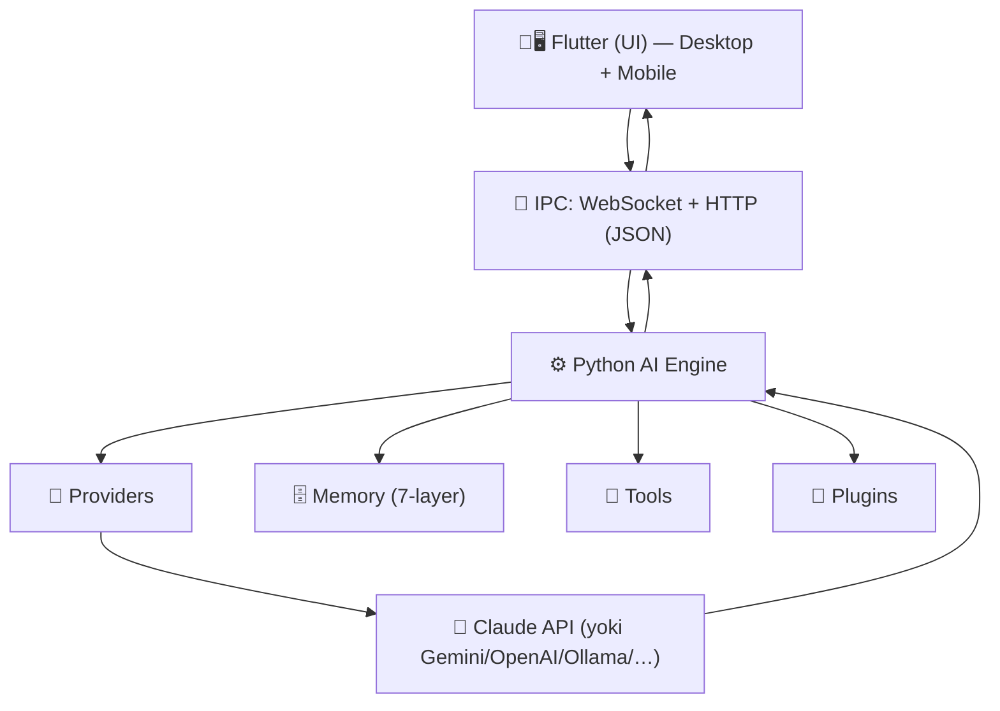
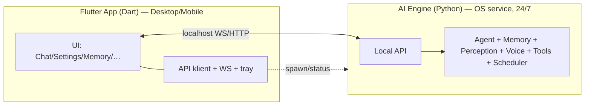

# DODA — Desktop (& Mobile) Application Architecture

> ✅ **YAKUNIY QAROR: Flutter** (Desktop + Mobile, bitta codebase) + **Python AI Engine**.
> Sabab (foydalanuvchi): Flutter developer; kelajakда Android/iOS bir xil codebase; UI'ni web+mobile
> bilan bir xil ushlab turish; professional cross-platform; uzoq-muddat qulay.
> Web-UI (mavjud dashboard) alohida **web-klient** bo'lib qoladi (brauzer/telegram).

---

## 1. Yakuniy oqim (foydalanuvchi belgilagан)

**IPC qarori:** **WebSocket + HTTP (JSON)** — barcha klient uchun **bitta API yuzasi** (Flutter/web/telegram/mobil).
Flutter'да `web_socket_channel` + `http` (yetuk). *(gRPC — kelajakда ixtiyoriy yuqori-unum kanal; web uchun grpc-web proksi kerak bo'lardi, shu sabab hozir bir yuza afzal.)*

---

## 2. To'liq mustaqillik (FE ⟂ BE)

- **UI process (Flutter)** yopilса → tray (Engine to'xtamaydi).
- **Engine process (Python)** — OS-service (launchd/systemd/Win Service), boot autostart, **UI'дан mustaqil**. Headless mini-PC'да ham faqat Engine.
- **Bir engine, ko'p klient:** aynan shu Flutter app **mobil**да ham (uy-server tunnel orqали) — bitta codebase, bitta API.

---

## 3. Flutter loyiha qatlamlari (feature-based)
| Qatlam | Nima |
|--------|------|
| **presentation** | Ekranlar (Chat/Settings/Memory/Tasks/Plugins/Logs/Vision/Developer) — [UI_GUIDE.md](UI_GUIDE.md) |
| **application** | State management (Riverpod/Bloc), use-case'lар |
| **data** | API klient (HTTP+WS), modellar (JSON↔Dart), repozitoriylar |
| **platform** | tray, autostart, notifications, secure-storage (per-OS) |

Clean Architecture Flutter tomonда ham qo'llanadi (SOLID/DI/test).

---

## 4. Hayot-tsikl
1. Login → Flutter app tray'да ochiladi (autostart).
2. Engine-service tekshiriladi (`/health`); ishlamаса start/ogohlantirish.
3. UI Engine'га ulanadi (WebSocket) — jonli suhbat/holat/ovoz.
4. Oyna yopilса → tray (Engine ishlayveradi).
5. Auto-update: Flutter app + Engine binar yangilanadi.

Paketlash/installer/CI — [../desktop/DESKTOP_ARCHITECTURE.md](../desktop/DESKTOP_ARCHITECTURE.md). Ekranlar — [UI_GUIDE.md](UI_GUIDE.md).
