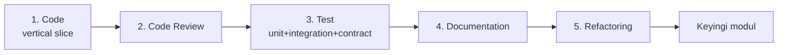

# DODA — Engineering Standards

> **Har modul shu standartlarга MAJBURIY amal qiladi.** Vaqtinchalik kod YO'Q. Quick-fix YO'Q.
> Har modul **production-ready**. Maqsad: 5–10 yil rivojlanadigan enterprise platforma.
> "Feature qo'shishдан ko'ra kod sifati ustuvor."

---

## 1. Arxitektura tamoyillari
- **Clean Architecture** — bog'liqlik ichkariga; domain tashqi kutubxonани bilmaydi.
- **SOLID** — ayniqsa DIP: modullar **portга** tayanadi, konkret klassга emas.
- **Dependency Injection** — ulanish `container.py` (composition root); global holat yo'q.
- **Event-Driven** — modullararo aloqa Event Bus; to'g'ridan bog'lanmaydi.
- **Async-First** — barcha I/O `async`; bloklaydigan ish `asyncio.to_thread`.

## 2. Kod sifati (avtomatik, CI'да majburiy)
| Vosita | Maqsad |
|--------|--------|
| **Black** | Formatlash (yagona uslub) |
| **Ruff** | Lint (xato/hid/import) |
| **MyPy** | Statik tip tekshiruvi (`--strict`) |
| **Type Hints** | 100% — har funksiya signature'i tiplangan |

## 3. Test (har modul uchun uchtala)
- **Unit** — sof mantiq, portlar mock qilinган.
- **Integration** — real adapter (masalan SQLite bilan).
- **Contract** — har port implementatsiyasi umumiy test-to'plamдан o'tadi (yangi provider avtomatik tekshiriladi).
- Coverage maqsadi: ≥ 80% (yadro mantiqда).

## 4. Kuzatuvchanlik va xatolar
- **Structured Logging** — JSON; sir/PII YOZILMAYDI; `trace_id` bilan.
- **Error Handling** — aniq exception turlari; "silent pass" yo'q; xato Event Bus'га (`error` event).
- **Configuration Management** — bitta `pydantic-settings` sxema; sehrли-raqam/hardcode yo'q.

## 5. Hujjatlashtirish (har modul)
- **README.md** — modul maqsadi, ishlatish, misol.
- **Architecture Diagram** — mermaid (modul ichki oqimi).
- **Docstrings** — public API tushuntirилган.
- Public interfeys o'zgarса — **CHANGELOG** + SemVer.

## 6. Definition of Done (modul yopilish sharti)
Modul faqat quyidagilar bajarilса **DONE**:
- [ ] Barcha portlar/klasslar type-hinted, `mypy --strict` toza
- [ ] `black` + `ruff` toza
- [ ] Unit + Integration + Contract testlar yozilган va o'tади (≥80%)
- [ ] Structured logging + error handling
- [ ] README + architecture diagram + docstrings
- [ ] Config'да (hardcode yo'q)
- [ ] Event Bus integratsiyasi (tegishli eventlar)
- [ ] Vaqtinchalik kod/TODO/quick-fix YO'Q
- [ ] Code review o'tган
- [ ] Eski v1.0.0 buzilmagan (smoke-test)

## 7. Modul ish oqimi (majburiy tartib)

Har modul — **kichik vertical slice** (uchdan-uchgacha ishlaydigan). Katta "big-bang" yo'q.

## 8. Xavfsizlik standartlari
Sirlar keychain'да (kodда/DB'да/logда emas) · sandbox+denylist (tool/agent) · barcha input validatsiya ·
audit (`tool_history`/`events`). Batafsil — [SECURITY.md](SECURITY.md).

## 9. Versiyalash
- **SemVer** har modul/paket.
- **Public SDK** (`doda.sdk`) va **API** (`/api/v1`) — buzuvchi o'zgarish faqat major + deprecation.

---
Bu standartlar **ROADMAP** har modulининг DoD'siга kiritiladi. Chetlanish — texnik-qarz sifatida qayd etiladi, keyingi modulга o'tishдан oldin yopiladi.
