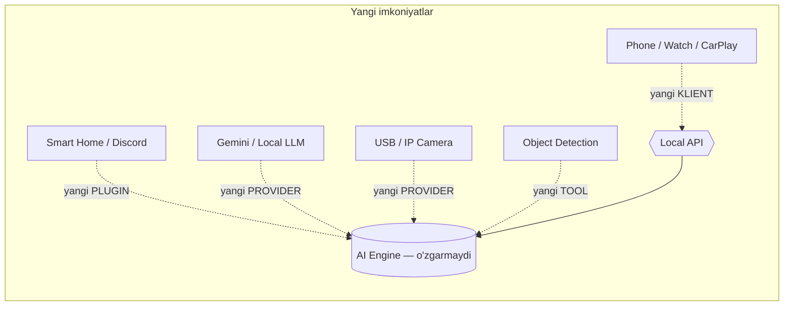

# DODA — Future Roadmap (Long-term Vision)

> 5–10 yillik yo'nalish. Har biri **hozirgi arxitekturага mos** — poydevor o'zgarmaydi,
> faqat yangi provayder/plugin/klient qo'shiladi. Bu arxitektura puxtaligini isbotlaydi.

---

## Bosqichlar bo'yicha

| Imkoniyat | Nima | Arxitekturага qanday tushadi | Bosqich |
|-----------|------|------------------------------|:-------:|
| **Multi-User** | Bir DODA'да ko'p foydalanuvchi, har biriga alohida xotira/persona | `user_id` barcha jadvалда tayyor; API'га user-kontekst | Yaqin |
| **Home AI** | Uy mini-PC'да 24/7 engine; doim ulangan kamera/mic/speaker | Engine ko'chadi, klientlar API'га ulanaveradi | Yaqin |
| **Face Recognition** | Odamlarni yuzidан tanish (mavjud, lokal) | `VisionProvider` + lokal `face_recognition` | ✅ Bor |
| **Object Detection** | Narsalarni aniqlash (stol, eshik, mashina…) | Yangi Vision-tool (YOLO lokal yoki LLM Vision) | O'rta |
| **Smart Home** | Chiroq/eshik/harorat boshqaruvi | **Plugin** (Home Assistant/MQTT) | O'rta |
| **Home Assistant** | Uy-avtomatlashtirish integratsiyasi | Plugin (API/webhook) | O'rta |
| **Robot** | Harakatlanuvchi qurilma (kamera+motor) | Yangi klient + tool (harakat API) | Uzoq |
| **Home Server** | Markaziy uy-serveri (barcha qurilma hub'i) | Engine = server; Postgres; ko'p-klient | O'rta |
| **Cloud Sync** | Qurilmalar orasida xotira sinxronizatsiyasi | `updated_at`/`deleted` maydonlari tayyor; opt-in, E2E-shifr | O'rta |
| **Phone App** | iOS/Android mobil klient | Bir xil **Local API** (tunnel); Flutter/native UI | Yaqin |
| **Wear OS** | Android soat'дан ovoz/eslatma | Yengil klient → API | Uzoq |
| **Apple Watch** | watchOS klient (ovoz, bildirishnoma) | Yengil klient → API | Uzoq |
| **CarPlay** | Mashinada ovozли DODA | CarPlay UI → API (ovoz-first) | Uzoq |
| **Android Auto** | Mashinada (Android) | Android Auto UI → API | Uzoq |

---

## Nega arxitektura o'zgarmaydi

Yangi narsa har doim **to'rt kengaytma nuqtasi**дан biri orqали qo'shiladi:
1. **Yangi klient** → API'га ulanadi (UI qatlami).
2. **Yangi plugin** → `plugins/` (core tegilmaydi).
3. **Yangi provider** → interfeys ortida (LLM/Vision/Memory/Speech).
4. **Yangi tool** → `tools/` yoki plugin orqали.

**Yadro (Agent + API + DB sxema)** barqaror qoladi → 5–10 yil rivojlanadi, qayta yozilmaydi.

---

## Uzoq muddatли orzular (research)
- **O'z Uzbek LLM'i / voice cloning** — kuchli Mac/GPU olингач fine-tune ([../ (own-model plan)]).
- **On-device reasoning** — internet'siz lokal model (Local LLM provider).
- **Proaktiv agent** — so'ramай foydali harakat (odatлардан o'rganib).
- **Ko'p-agent** — ixtisoslashган sub-agentlar (koder, uy, moliya) orkestrovka ostida.
