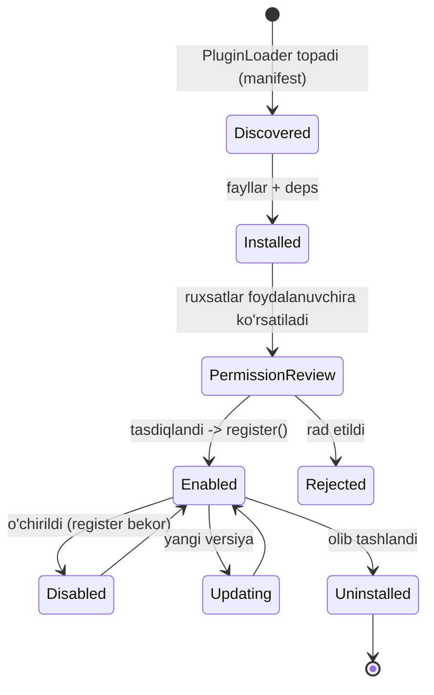

# DODA — Plugin System & SDK

> Yangi imkoniyat qo'shishда **core kod o'zgarmasin**. Plugin — mustaqil, ruxsat-so'raydigan,
> o'rnatiladigan/yangilanadigan modul. Misollar: Telegram, WhatsApp, Discord, GitHub,
> Smart Home, Home Assistant, Camera, Browser.

---

## 1. Plugin nima beradi
Plugin quyidagilarни ro'yxatga qo'shishi mumkin (core'ni o'zgartirmasдан):
- **Tools** — AI chaqiradigan yangi asboblar (`register_tool`)
- **Providers** — LLM/Vision/Memory/STT/TTS implementatsiyalari (`register_provider`)
- **Event handlers** — hodisaларга obuna (`on_event`)
- **Scheduled jobs** — takroriy vazifalar (`register_job`)
- **API routes** — o'z endpointlari (`register_route`)
- **UI panels** — Desktop'да o'z oynasi (manifest orqали)

---

## 2. Plugin strukturasi
```
plugins/telegram/
├── plugin.toml          # manifest (nom, versiya, ruxsatlar, entrypoint)
├── plugin.py            # Plugin klassi (register())
├── requirements.txt     # izolyatsiyalangan bog'liqliklar (ixtiyoriy)
├── ui/                  # ixtiyoriy UI panel (web)
└── README.md
```

### `plugin.toml` (manifest)
```toml
[plugin]
name = "telegram"
version = "1.0.0"
description = "Telegram orqali boshqaruv"
entrypoint = "plugin:TelegramPlugin"
min_doda = "2.0.0"

[permissions]           # foydalanuvchi tasdiqlaydi
network = true          # internet
tools = ["send_message"]
read_memory = false
run_shell = false
devices = []
```

### `plugin.py` (SDK interfeysi)
```python
from doda.sdk import Plugin, tool, PluginContext

class TelegramPlugin(Plugin):
    name = "telegram"

    def register(self, ctx: PluginContext) -> None:
        ctx.add_tool(self.send_message)          # AI chaqira oladi
        ctx.on_event("task.fired", self.notify)  # hodisaга obuna

    @tool(description="Telegram'да xabar yuboradi")
    async def send_message(self, to: str, text: str) -> str:
        ...   # ctx.require("network") — ruxsat tekshiriladi
```
> **`doda.sdk`** — barqaror **public SDK** (semantik versiyalar). Plugin faqat SDK'ни biladi, ichki kodни emas → core refaktor plugin'ni buzmaydi.

---

## 3. Lifecycle (hayot-tsikl)


- **Discover** — `PluginLoader` startup'да `plugins/` + o'rnatilган-registry'ni skanerlaydi.
- **Load** — manifest o'qiladi, min_doda mosligi, deps izolyatsiyasi.
- **Permission review** — so'ralган ruxsatlar foydalanuvchiга ([SECURITY.md](SECURITY.md)); tasdiqlanса `plugins.permissions`га yoziladi.
- **Enable** → `register(ctx)` chaqiriladi. **Disable** → registratsiya bekor (hot, restart shart emas).
- **Update** — versiya solishtiriladi, imzo tekshiriladi, disable→almashtir→enable.

---

## 4. Permission model (sandbox)
- Plugin **deklarativ** ruxsat so'raydi (manifest); `PluginContext` har amalда `ctx.require(perm)` bilan tekshiradi.
- Ruxsatlar: `network`, `read_memory`, `write_memory`, `run_shell`, `filesystem`, `devices`, `tools[...]`.
- Ruxsatsiz amal → `PermissionDenied` (audit `events`га).
- Plugin **alohida namespace**да; core ichki obyektlarга to'g'ridan kira olmaydi (faqat SDK).
- Kelajak: og'ir izolyatsiya (subprocess/WASM) untrusted plugin uchun.

---

## 5. Install / Update
| Manba | Qanday |
|-------|--------|
| **Local** | `plugins/` папкага papka tashlash |
| **URL/Git** | `POST /plugins/install {source}` — yuklab, imzo tekshirib o'rnatadi |
| **Plugin Store** (kelajak) | Desktop UI'дан bir tugma; imzolangan katalog |

- Har o'rnatishда: manifest validatsiya + imzo + ruxsat-review.
- Update: `POST /plugins/{id}/update` — semantik versiya, imzo, atomik almashtirish.
- Holat `plugins` jadvалида ([DATABASE.md](DATABASE.md)).

---

## 6. Rasmiy pluginlar (birinchi to'plam)
Telegram · Web Dashboard · Camera · Browser — hozirgi funksiyalar **plugin sifatida qayta quriladi** (core yengil qoladi). Keyin: WhatsApp, Discord, GitHub, Home Assistant, Smart Home.

## 7. Kafolat
- **Core barqaror** — plugin qo'shish/olib tashlash core'ни o'zgartirmaydi (Open/Closed).
- **SDK versiyalangan** — `min_doda` bilan moslik; buzuvchi o'zgarish → yangi major.
- Har plugin mustaqil test qilinadi (mock `PluginContext`).
