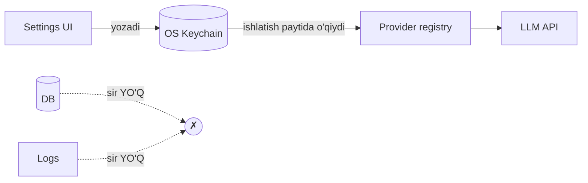
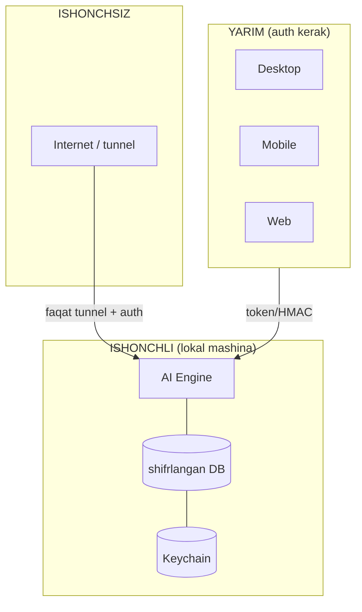

# DODA — Security & Privacy

> Tamoyil: **Local-first, zero-trust-to-clients, secrets-never-in-code.** DODA kompyuterni
> boshqaradi va shaxsiy ma'lumot saqlaydi — shuning uchun xavfsizlik birinchi darajali.

---

## 1. API kalitlar qayerda saqlanadi

| Manba | Saqlash | Sabab |
|-------|---------|-------|
| Claude/Gemini/OpenAI kalitlari | **OS xavfsiz-xotirasi** (`keyring`): macOS Keychain · Windows Credential Manager · Linux Secret Service | OS-daraja shifr, boshqa ilova o'qiy olmaydi |
| Muqobil | Shifrlangan config yoki env-o'zgaruvchi (fayl `chmod 600`) | keychain yo'q muhitда |
| **HECH QACHON** | ❌ kodда · ❌ DB'да · ❌ log'да · ❌ git'да · ❌ chatда | leak xavfi |

- Settings-UI kalitni **yozadi** (keychain'га), lekin qiymatini **qaytarmaydi** (faqat "o'rnatilган ✅").
- `LLMProvider` registry kalitni keychain'дан **ishlatish paytida** o'qiydi. Provayder almashса kod o'zgarmaydi ([API.md](API.md) `/providers`).

---

## 2. Local database himoyasi
- **Shifrlash:** SQLCipher (AES-256) yoki OS fayl-tizim shifri (FileVault/BitLocker) — DB kaliti keychain'да.
- Fayl OS app-data papkasида, ruxsat 600 (faqat foydalanuvchi).
- **Sirlar DB'да yo'q** — faqat keychain'да; DB'да token-**xesh** (`api_tokens`), xom emas.
- Migratsiya/backup shifrlanган holатda.

---

## 3. Klient autentifikatsiyasi (API)
- Har klient (desktop/mobile/web) — `api_tokens`даги token (xesh saqlanadi).
- `hmac.compare_digest` (constant-time). Telegram Mini App — initData HMAC imzosi.
- Cookie (web): `HttpOnly; SameSite=Strict; Secure` (HTTPS'да).
- Masofaviy kirish faqat tunnel + token/imzo. Anonim kirish yo'q (`/health`дан tashqari).
- **Rate-limit** (429) — brute-force'га qarshi.
- Telegram/Engine: **owner-only** (`~/.doda_owner_id`); begona urinishда egaga ogohlantirish.

---

## 4. Secrets qanday ishlaydi (oqim)

Sir faqat **xotirada, ishlatish onида** yashaydi; diskда shifrlangan keychain'да.

---

## 5. Loglar — nima yoziladi / yozilmaydi
✅ **Yoziladi:** hodisa turi, modul, vaqt, xato turi/traceback, tool nomi, davomiylik.
❌ **YOZILMAYDI:** API kalit/token, parol, suhbat to'liq matni (agar `privacy.log_content=false`), xom kamera kadri, audio (default), shaxsiy ma'lumot.
- Loglar rotatsiya + retention (30 kun, [DATABASE.md](DATABASE.md)).
- O'tkinchi tarmoq xatolari markaziy log'ни ifloslamaydi.

---

## 6. Privacy (maxfiylik)
- **Local-first:** hamma ma'lumot foydalanuvchi qurilmasида. Cloud'га **hech narsa** yuborilmaydi — faqat LLM so'rovi (foydalanuvchi yoqса) va u ham minimal kontekst.
- **Vision:** xom kadr default saqlanmaydi (faqat thumbnail/natija, [DATABASE.md](DATABASE.md)). Yuz-ma'lumoti lokal (`face_recognition`), bulutга chiqmaydi.
- **Voice:** audio default saqlanmaydi (faqat transkript, sozlanadi).
- **Opt-in cloud:** Cloud Sync ([FUTURE.md](FUTURE.md)) — faqat foydalanuvchi yoqса, uchdan-uchgacha shifr bilan.
- **Data export/delete:** foydalanuvchi hamma ma'lumotini eksport/o'chira oladi (GDPR-uslub).

---

## 7. Ishonchli-zona (trust boundaries)

## 8. Kompyuter-boshqaruv xavfsizligi (tool/agent)
- Terminal/agent: **sandbox** (`WORKSPACE`, `realpath` traversal-himoya), **xavfli buyruq denylist**, **tasdiqlash tugmasi** (masofадан).
- Plugin ruxsatlari — deklarativ + foydalanuvchi tasdig'и ([PLUGINS.md](PLUGINS.md)).
- Har tool chaqiruvi `tool_history`да audit qilinadi.

## 9. Yangilanish xavfsizligi
- Auto-update **imzolangan** (Flutter + macOS notarization + Windows code-sign). Imzosiz update rad etiladi (MITM himoyasi).

## 10. Kod imzolash (byudjet)
- macOS: Apple Developer ($99/yil) + notarization.
- Windows: code-signing sertifikati (EV/OV).
- Aks holda: OS "noma'lum dasturchi" ogohlantirishi + updater ishonchsizligi. — release oldidan hal qilinadi.
