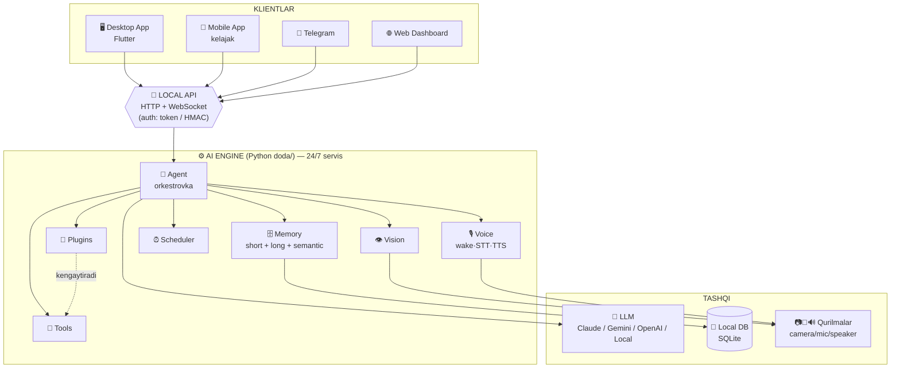
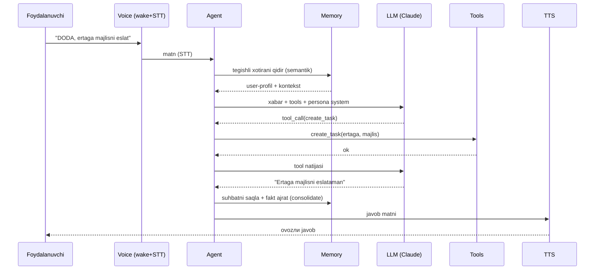

# DODA — System Design (High-Level Architecture)

> Butun DODA platformasining umumiy arxitekturasi. Bu **manba hujjat** — barcha boshqa
> hujjatlar (DATABASE, API, DESKTOP, SECURITY, PLUGINS, UI_GUIDE, FUTURE) shunga tayanadi.
> Maqsad: 5–10 yil o'zgarmaydigan puxta poydevor.

---

## 1. Mahsulot tavsifi

DODA — **doimiy shaxsiy AI agent**. Bitta **AI Engine** (Python), ko'p **klient** (Desktop, Mobile, Telegram, Web) va bitta **markaziy API** orqali ishlaydi. Engine 24/7 servis; klientlar unga ulanadi.

**Asosiy tamoyil:** *Local-first, API-centric, provider-agnostic.*
- **Local-first** — hamma ma'lumot foydalanuvchi qurilmasida (maxfiylik).
- **API-centric** — hamma klient bitta lokal API orqali (bir marta yoz, hamma joyda ishlaydi).
- **Provider-agnostic** — LLM/kamera/xotira almashtiriladi, kod o'zgarmaydi.

---

## 2. System Context (kim kim bilan gaplashadi)



---

## 3. Komponentlar va mas'uliyat

| Komponent | Mas'uliyat | Hujjat |
|-----------|-----------|--------|
| **Desktop App** | O'rnatiladigan UI qobig'i (Flutter, desktop+mobil), tray, updater, Settings | [DESKTOP.md](DESKTOP.md), [UI_GUIDE.md](UI_GUIDE.md) |
| **AI Engine** | Yadro — barcha mantiqni orkestrovka qiladi (Agent tsikli) | [../doda/ARCHITECTURE.md](../doda/ARCHITECTURE.md) |
| **Local API** | Barcha klient uchun yagona kirish (HTTP+WS) | [API.md](API.md) |
| **Memory** | Short (kontekst) + Long (fakt/loyiha/reja) + semantik qidiruv | [DATABASE.md](DATABASE.md) |
| **Vision** | Kameradан kadr → LLM Vision (provider: mac/usb/ip) | [../doda/ARCHITECTURE.md](../doda/ARCHITECTURE.md) |
| **Voice** | Wake("DODA") → STT → Agent → TTS pipeline | — |
| **Scheduler** | Vazifa/eslatma (bir martalik + cron) | [DATABASE.md](DATABASE.md) |
| **Tools** | AI chaqiradigan asboblar (terminal/fayl/brauzer…) | — |
| **Plugins** | Kengaytmalar (Telegram/Discord/Home Assistant…) | [PLUGINS.md](PLUGINS.md) |
| **Telegram / Mobile / Web** | Masofaviy klientlar (bir xil API) | [API.md](API.md) |
| **Future Home AI** | Mini-PC'да engine 24/7 + doim ulangan kamera/mic/speaker | [FUTURE.md](FUTURE.md) |

---

## 4. So'rov hayot-tsikli (voice misolда)



---

## 5. Deployment topologiyasi

**Hozir (bitta Mac):** Engine + klientlar bir mashinada; telefon tunnel orqали.
```
[Mac] Engine(service) + Desktop(UI) + Web + Telegram bot   ← tunnel ←   [Telefon]
```

**Kelajak (Home AI):** alohida mini-PC uy-serveri; hamma qurilma unда.
```
[Mini-PC uy-server] Engine 24/7 + USB kamera/mic/speaker
        ↑ LAN / tunnel ↑
[Telefon] [Mac] [Wear OS] [CarPlay] … — hammasi bir API'га
```

Arxitektura **o'zgarmaydi** — faqat engine boshqa mashinaga ko'chadi, klientlar API'га ulanaveradi.

---

## 6. Ko'ndalang tamoyillar (barcha modulга taalluqli)

- **Async** hamma joyda (I/O-bound); bloklaydigan ish thread-executor'да.
- **Provider pattern** — LLM/Vision/Memory/STT/TTS interfeys ortida (almashtiriladi).
- **DI composition root** — ulanish bitta joyda (`doda/container.py`).
- **Xavfsizlik** — sirlar OS-keychain'да, DB shifrlanadi, local-first ([SECURITY.md](SECURITY.md)).
- **Versiyalash** — API `/api/v1`, SemVer, migratsiyalar.
- **Kuzatuvchanlik** — strukturali loglar, `/health` `/status`, watchdog.

Batafsil: har bir yo'nalish o'z hujjatida.
