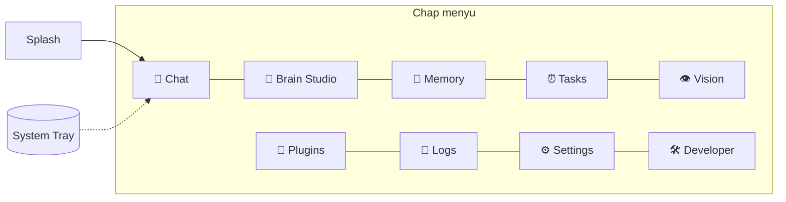

# DODA — Desktop UI Guide

> Desktop dastur (Flutter) ekranlari va ularning vazifasi. Dizayn tili — mavjud panel uslubi:
> qorong'i teal (`#070d0c` fon, `#2fd6bd` accent), glassmorphism, 3D avatar, i18n (uz/ru/en).
> Layout: chap **rail menyu** + asosiy maydon (mavjud `dashboard.html` naqshi rivojlanadi).

---

## Ekranlar xaritasi



---

## Har bir ekran

### 🌀 Splash
- **Vazifa:** ishga tushish — logo/avatar animatsiyasi; Engine-service holatini tekshiradi (`/health`), ulanadi.
- Xato bo'lsa: "Engine ishga tushirilyapti…" yoki tuzatish yo'l-yo'rig'i.

### 💬 Chat (asosiy)
- **Vazifa:** DODA bilan suhbat (matn + ovoz). Markazда **3D avatar** (holat: tinglayapti/o'ylayapti/gapiryapti).
- Elementlar: xabar oqimi (stream), matn kiritish, 🎤 ovoz tugmasi, suhbatlar tarixi (yon-panel), til almashtirgich.
- WebSocket orqали jonli: token-stream javob, ovoz holati.

### 🧠 Memory
- **Vazifa:** DODA nimani eslab qolganini ko'rish/tahrirlash — foydalanuvchi shaffofligi.
- Elementlar: xotiralar ro'yxati (type bo'yicha filtr: fakt/loyiha/reja/odat/qiziqish), qidiruv (semantik), tahrirlash/o'chirish, muhimlik.

### ⏰ Tasks
- **Vazifa:** vazifa/eslatmalarни boshqarish.
- Elementlar: faol/bajarilган/takroriy ro'yxat, yangi vazifa (vaqt/cron), bekor qilish, keyingi ishga tushish vaqti.

### 👁️ Vision
- **Vazifa:** kamera orqали ko'rish.
- Elementlar: jonli kamera preview, "Nima ko'ryapsan?" tugmasi + natija, kamera tanlash (mac/usb/ip), ko'rish tarixi (thumbnail).

### 🔌 Plugins
- **Vazifa:** pluginlarni boshqarish + o'rnatish (Plugin Store).
- Elementlar: o'rnatilганlar (yoq/o'chir/yangila/sozla), ruxsatlar ko'rinishi, katalogdан o'rnatish, plugin UI-panellari.

### 📝 Logs
- **Vazifa:** tizim holati va xatolar (diagnostika).
- Elementlar: strukturali loglar (daraja filtri), hodisalar timeline, tool_history/vision/voice tarixi, tozalash.

### ⚙️ Settings
- **Vazifa:** yagona sozlamalar markazi.
- Bo'limlar:
  - **Umumiy** — til, ishga tushish (autostart), tray xatti-harakati.
  - **AI** — provayder (Claude/Gemini/OpenAI/Local) + model; **API kalitlar** (keychain'га, qiymat ko'rinmaydi).
  - **Qurilmalar** — 📷 kamera, 🎤 mikrofon, 🔊 dinamik tanlash.
  - **Ovoz** — wake-word, TTS ovozi/tezligi.
  - **Xotira/Privacy** — retention, kontent-log yoq/o'chir, ma'lumot eksport/o'chirish.
  - **Yangilanish** — versiya, auto-update tekshirish.

### 🧠 Brain Studio (DODA aqlining cockpit'i)
- **Vazifa:** DODA'ning ichki holatini **real vaqtда** kuzatish, tahlil qilish va boshqarish.
  Faqat monitor emas — goal qo'yish, tavsiyalarni tasdiqlash markazi. To'liq: [BRAIN_STUDIO.md](BRAIN_STUDIO.md).
- **Ma'lumot:** WebSocket (jonli eventlar) + HTTP (snapshot); hamma mantiq backend'da.
- **Tarh (panellar real vaqtда yangilanadi):**
```
┌──────────────────────────── 🧠 BRAIN STUDIO ────────────────────────────┐
│  🎯 Current Goal ▸ Sub-Goals ▸ Progress        │  💭 Thinking Log        │
│  💭 Current Task: "…"                           │   Searching memory…     │
│                                                 │   Planning response…    │
│  📚 Memory  📝 Conversation  📅 Scheduler       │   Choosing tool…        │
│  📷 Vision  🎤 Mic  🔊 Speaker                  │   Calling Claude API…   │
│  🔌 Active Plugins   🧰 Active Tools            │   Saving memory… ✅      │
├─────────────────────────────────────────────────┴─────────────────────────┤
│  🕒 Event Timeline —  16:30 User → Memory → Planning → 16:31 Claude → Tool  │
├──────────────┬───────────────┬───────────────┬─────────────────────────────┤
│ 💰 API Cost   │ 📈 Token Usage │ 🖥 CPU 💾 RAM  │ ⚡ Event Bus   │ 📂 Logs     │
├──────────────┴───────────────┴───────────────┴─────────────────────────────┤
│  🔎 Self-Review (quality/cost/latency/errors)   |   📈 Learning (kunlik)     │
│  🛠 Recommendations / Improvements      [ Ko'rish ]  [ ✅ Tasdiqlash ]        │
└─────────────────────────────────────────────────────────────────────────────┘
```
- **Boshqaruv:** goal qo'yish/steer · Self-Improvement patch'ini **ko'rish + tasdiqlash**
  (🔒 tasdiqsiz hech narsa qo'llanmaydi — [BRAIN_STUDIO.md §9](BRAIN_STUDIO.md)).

### 🛠️ Developer
- **Vazifa:** ilg'or/debug (ixtiyoriy, kengaytiriladigan).
- Elementlar: API konsoli, tool test, provayder holati, WebSocket monitor, DB ko'rinishi.

---

## Tray menyu (barcha OS)
- Holat: 🟢 Engine · 🔋 batareya · 💻 CPU
- Tez amallar: Oynani ochish · Ovoz yoq/o'chir · Engine restart · Settings · Chiqish
- Oyna yopilса → tray (Engine ishlayveradi).

## Umumiy tamoyillar
- **Responsive** — kichik oynаda rail ikonка-panelга, keng oynаda yozuvli.
- **i18n** — barcha matn uz/ru/en (mavjud i18n tizimi).
- **Real-vaqt** — holat/ovoz/stream WebSocket orqали.
- **Accessible** — klaviatura navigatsiyasi, kontrast.
