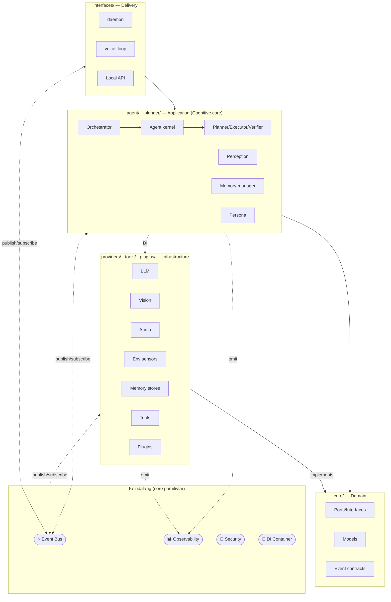
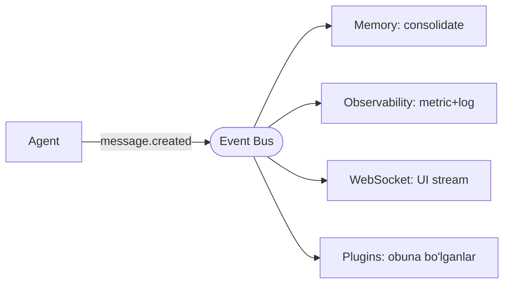
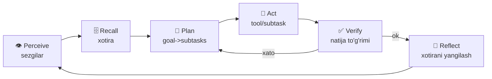
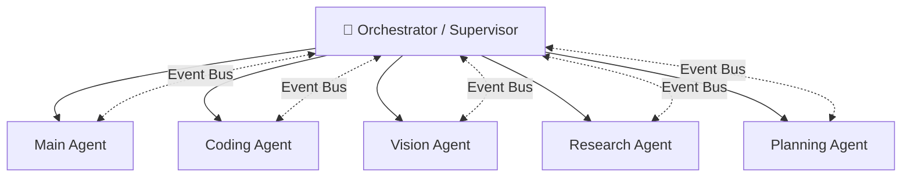

# DODA — Arxitektura (Enterprise Personal AI Agent) · v2

> Maqsad: **ChatGPT / Claude Desktop / Cursor darajasidagi** professional shaxsiy AI agent.
> **Tamoyillar:** Clean Architecture · SOLID · **Event-Driven** · **Plugin-First** · **Cognitive-Agent** ·
> Provider-Agnostic · Async · Feature-based · Local-first.
>
> ⚠️ Mavjud **v1.0.0** (flat) ishlab turadi; yangi `doda/` **yonida** quriladi, modul-ba-modul
> parity'ga yetganда almashtiriladi. Umumiy platforma dizayni — [`../docs/`](../docs/README.md).

---

## 1. Tayanch tamoyillar

| Tamoyil | Ma'no |
|---------|-------|
| **Clean Architecture** | Bog'liqlik faqat ichkariga; domain tashqi kutubxonани bilmaydi |
| **SOLID / Dependency Inversion** | Modullar interfeys (port)га tayanadi, konkret klassга emas |
| **Event-Driven (Event Bus)** | Modullar bir-birini to'g'ridan chaqirmaydi — **pub/sub** orqali bo'shashadi |
| **Plugin-First** | Hatto core funksiyalar (Telegram/Web/Camera) ham plugin; yangi imkoniyat core'ni buzmaydi |
| **Cognitive-Agent** | Agent = Perceive→Recall→Plan→Act→Verify→Reflect (chatbot emas) |
| **Provider-Agnostic** | LLM/Vision/Memory/Speech almashtiriladi, kod o'zgarmaydi |

---

## 2. Qatlamlar (Clean Architecture) + ko'ndalang xizmatlar



Sinxron **request/response** (masalan `Agent → LLMProvider.chat`) to'g'ridan chaqiriladi;
**side-effect va modullararo xabar** (`message.created`, `task.fired`, `vision.result`) **Event Bus** orqali. Bu — real-tizim balansi (hamma narsa event emas, faqat bog'lanish nuqtalari).

---

## 3. ⚡ Event Bus (talab #12) — Event-Driven yadro

**`EventBus` — core primitivi** (port `core/interfaces/bus.py`, implementatsiya `providers/bus/`).
Modullar bir-birini bilmaydi; faqat **event nomi**ni biladi.

```python
class EventBus(Protocol):
    async def publish(self, event: Event) -> None: ...
    def subscribe(self, name: str, handler: Callable[[Event], Awaitable]) -> Unsubscribe: ...
```

**Namuna oqim (bir hodisa, ko'p mustaqil reaksiya):**


**Event katalogi (barqaror kontraktlar, `core/models/events.py`):**
`message.created` · `chat.token` · `tool.called` · `tool.result` · `memory.updated` ·
`perception.frame` · `vision.result` · `voice.state` · `task.created|fired|done` ·
`plugin.enabled|disabled` · `device.changed` · `provider.switched` · `error` · `notification`.

**Foyda:** yangi modul/plugin faqat obuna bo'ladi — hech kimni o'zgartirmaydi (Open/Closed). Lokal `asyncio` bus; kelajakда tashqi broker (NATS/Redis) — port o'zgarmaydi.

---

## 4. 🧠 Cognitive Agent (talab #5 Planning, #4 Perception)

Agent — chat-loop emas, **kognitiv tsikl**:



### 4a. Perception Layer (talab #4) — **sezgilar** (yagona abstraksiya)
Vision faqat bitta sezgi. Barcha kirish `PerceptionProvider`/sensor sifatida:

| Guruh | Sezgilar | Port |
|-------|----------|------|
| **Vision** | Mac / USB / RTSP / IP kamera · Screen capture | `VisionProvider` |
| **Audio** | Microphone · Wake word | `AudioSensor`, `WakeWordDetector` |
| **Environment** | Clipboard · Notifications · Calendar · Time · Weather · Active window | `EnvSensor` |

Sezgilar `perception.*` eventlarini chiqaradi; agent kontekst yig'ganда yoki so'rovда o'qiydi. Yangi sensor = yangi provider, core o'zgarmaydi.

### 4b. Planning Engine (talab #5)
```
Goal → Planner (LLM: subtasklar rejasi) → Executor (har subtask: tool/agent) →
Verifier (natijani tekshiradi) → ok? tugadi : replan/retry (cheklangan urinish)
```
`core/interfaces/planner.py`: `Planner.plan(goal, context) -> Plan`; `Executor.run(plan)`; `Verifier.check(step, result) -> Verdict`. Oddiy so'rov → to'g'ridan Act (rejasiz); murakkab goal → to'liq tsikl. **ReAct + Plan-and-Execute** gibrid.

---

## 5. 🗄️ Advanced Memory — 7 qatlam (talab #3)

```mermaid
flowchart TB
    WM[1. Working Memory<br/>RAM · joriy vazifa/skratchpad] 
    CM[2. Conversation Memory<br/>joriy suhbat oynasi]
    EM[3. Episodic Memory<br/>voqealar: qачон/nima bo'ldi]
    SM[4. Semantic Memory<br/>faktlar/tushunchalar + embeddings]
    LT[5. Long-term Memory<br/>doimiy fakt/loyiha/reja/odat]
    UP[6. User Profile<br/>kim/afzalliklar/uslub]
    KB[7. Knowledge Base<br/>hujjat/manba (RAG)]
    WM --> CM --> EM --> SM --> LT
    UP -. har so'rovda inject .-> WM
    KB -. semantik qidiruv .-> WM
```

| Qatlam | Umr | Saqlash |
|--------|-----|---------|
| Working | soniya-daqiqa | RAM (agent state) |
| Conversation | sessiya | `messages` (oyna) |
| Episodic | uzoq | `events` + `memories(type=episodic)` |
| Semantic | doimiy | `memories(type=fact)` + `embeddings` |
| Long-term | doimiy | `memories` |
| User Profile | doimiy | `users.prefs` + `memories(type=preference)` |
| Knowledge Base | doimiy | `documents`/`memories(type=kb)` + `embeddings` (RAG) |

`MemoryManager` (application) bu qatlamlarni orkestrovka qiladi: **Recall** (semantik+profil+KB→working), **Consolidate** (suhbatдан episodic/semantic ajratish), **Forget** (retention). Interfeys — `MemoryStore` + `EmbeddingProvider` (Vector DB kelajakда, port o'zgarmaydi).

---

## 6. 🤖 Multi-Agent orkestrovka (talab #6) — kelajak-tayyor

Bugun **bitta agent**; arxitektura **Orchestrator** ostида ko'p ixtisoslashган agentga tayyor:



`Agent` — interfeys; `Orchestrator` goal'ни mos agentga yo'naltiradi (yoki parallel). Agentlar **Event Bus** orqали hamkorlik qiladi (to'g'ridan bog'lanmaydi). Hozir bitta `MainAgent` shu interfeysни amalga oshiradi — keyin qo'shiladi, core o'zgarmaydi.

---

## 7. 🔌 Provider arxitekturasi (talab #2) — to'liq ro'yxat

```
LLMProvider (port)
 ├── ClaudeProvider (asosiy) │ Gemini │ OpenAI
 ├── OllamaProvider │ LMStudioProvider (lokal)
 ├── OpenRouterProvider (ko'p-model gateway)
 └── FutureProvider …
providers/llm/registry.py — config.llm.provider bo'yicha tanlaydi.
```
Xuddi shu naqsh: **Vision** (mac/usb/rtsp/ip/screen), **Memory store**, **STT/TTS**, **EventBus**, **Embedding**. Hech biri core bilan bog'lanmagan.

---

## 8. 📊 Observability (talab #9) — ko'ndalang

`core/interfaces/observability.py` — 5 yo'nalish, Event Bus'га ulanган:
| Yo'nalish | Nima | Vosita |
|-----------|------|--------|
| **Logging** | Strukturali JSON loglar (sir/PII'siz) | stdlib + fayl |
| **Metrics** | So'rov/token/latency/xato hisoblagichlari | ichki registr → `/status` |
| **Tracing** | So'rov oqimini kuzatish (trace_id har eventда) | trace_id propagation |
| **Crash Reports** | Kutilmagan xato → yig'iladi (opt-in yuborish) | crash handler |
| **Health** | `/health` `/status` + watchdog | endpoint |
Har event `trace_id` tashiydi → butun kognitiv tsiklni uchdan-uchgacha kuzatish mumkin.

Observability ustiga **ikki subsistema** quriladi (Event Bus'дан oziqlanadi):
- **📈 Telemetry & Analytics (M14)** — TIZIM: CPU/RAM/Disk, API-chaqiruv, token/xarajat, tool/plugin statistikasi, crash/error, health, perf → `/status` + dashboard.
- **🎯 AI Evaluation (M13)** — SIFAT: prompt-versioning, javob-baholash, regression-test, benchmark, sifat-metrikalari, latency, prompt-tarix → modellarни (Claude↔Gemini↔…) taqqoslash.

---

## 9. Ports katalogi (`core/interfaces/`) — barqaror kontraktlar

`LLMProvider` · `VisionProvider` · `AudioSensor` · `EnvSensor` · `WakeWordDetector` ·
`STTProvider` · `TTSProvider` · `MemoryStore` · `EmbeddingProvider` · `Tool` · `Plugin` ·
`Scheduler` · **`EventBus`** · **`Planner`/`Executor`/`Verifier`** · **`Agent`/`Orchestrator`** ·
`SecretStore` · `Observability`.

**Modellar** (`core/models/`): `Message`, `LLMResponse`, `ToolSpec/ToolResult`, `MemoryItem`,
`Task`, `MediaFrame`, `Persona`, **`Event`**, **`Plan/Step/Verdict`**, `Perception`.

---

## 10. Plugin-First + SDK (talab #7)
- **Core = minimal yadro**; Telegram/Web/Camera/Browser **plugin sifatida** quriladi.
- SDK: `plugin.toml` manifest, `Plugin.register(ctx)`, deklarativ **permissions**, **hot-reload** (disable→almashtir→enable, restart shart emas), **version compatibility** (`min_doda`, SemVer). To'liq — [`../docs/PLUGINS.md`](../docs/PLUGINS.md).

## 11. Texnologiya tanlovlari (YAKUNIY)

**Frontend (UI):** **Flutter** — bitta codebase'дан **Desktop (mac/win/linux) + Mobile (iOS/Android)**.
Native, professional, uzoq-muddat. Web-UI (dashboard) alohida **web-klient** bo'lib qoladi (brauzer/telegram).
**Backend (AI Engine):** **Python 3.13** — o'zgarmaydi. **FE va BE to'liq mustaqil** (alohida jarayon).

**IPC (Flutter ↔ Python):** **WebSocket + HTTP (JSON)** — barcha klient uchun **bitta API yuzasi**
(Flutter/web/telegram/mobil). *(gRPC — kelajakда ixtiyoriy yuqori-unum ichki kanal; hozir bir yuza afzal.)*

```
Flutter Desktop/Mobile (UI)  →  WebSocket+HTTP (IPC)  →  Python AI Engine
   →  Providers  →  Claude/Gemini/…  →  Memory  →  Tools  →  Plugins
```

**Backend stack:** asyncio · pydantic-settings · qo'lда DI container · SQLModel (SQLite→Postgres) ·
Event Bus lokal `asyncio` (keyin NATS/Redis) · embeddings pluggable · APScheduler · OpenCV (kamera) ·
SpeechRecognition/Whisper/edge-tts · keyring (secrets) · OpenTelemetry-uslub tracing.
**Paketlash:** Python → PyInstaller sidecar/service; Flutter → flutter_distributor/msix/dmg (CI/CD).

## 12. Muhandislik standartlari (MAJBURIY, har modul)

Har modul **production-ready** — vaqtinchalik kod / quick-fix YO'Q. To'liq — [`../docs/ENGINEERING_STANDARDS.md`](../docs/ENGINEERING_STANDARDS.md).
> Clean Architecture · SOLID · **Async-First** · Type Hints + **MyPy** · **Ruff** + **Black** · DI ·
> **Unit + Integration + Contract** testlar · Structured Logging · Error Handling · Config Mgmt ·
> Documentation + README + Architecture Diagram · **Definition of Done**.

Bosqichlar — **[ROADMAP.md](ROADMAP.md)**. Audit — **[ARCHITECTURE_REVIEW.md](ARCHITECTURE_REVIEW.md)**. Standartlar — **[../docs/ENGINEERING_STANDARDS.md](../docs/ENGINEERING_STANDARDS.md)**.
