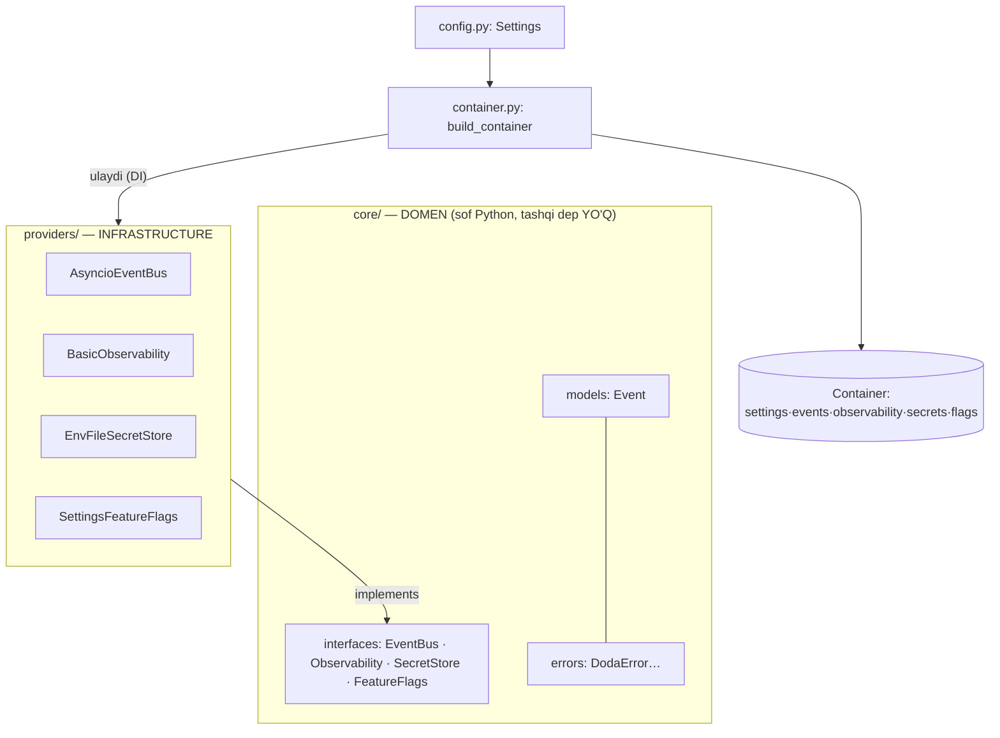

# DODA Engine (`doda/`) — Python AI Agent

Enterprise shaxsiy AI Agent platformasining **backend**i. Clean Architecture · SOLID ·
Event-Driven · Async · Plugin-First. Mavjud **v1.0.0** (flat) **yonida** quriladi, modul-ba-modul.

- Ichki arxitektura — [ARCHITECTURE.md](ARCHITECTURE.md)
- Modullar rejasi (M1–M14) — [ROADMAP.md](ROADMAP.md)
- Audit — [ARCHITECTURE_REVIEW.md](ARCHITECTURE_REVIEW.md)
- Platforma dizayni — [../docs/README.md](../docs/README.md)

---

## Modul 1 — Foundation ✅

Foundation = keyingi barcha modullar tayanadigan **kesishuvchi yadro**. Konkret, ishlaydigan,
test qilingan primitivlar + portlar.

### Nima beradi

| Komponent | Port (core) | Implementatsiya (providers) |
|-----------|-------------|------------------------------|
| **Event Bus** (pub/sub) | `core/interfaces/bus.py` | `providers/bus/asyncio_bus.py` |
| **Observability** (log/metric/span) | `core/interfaces/observability.py` | `providers/observability/basic.py` |
| **Secret Store** (env+fayl→keychain) | `core/interfaces/secrets.py` | `providers/secrets/env_file_store.py` |
| **Feature Flags** | `core/interfaces/flags.py` | `providers/flags/settings_flags.py` |
| **Config** (pydantic-settings) | — | `config.py` |
| **DI Container** (composition root) | — | `container.py` |
| **Domain models / errors** | `core/models/`, `core/errors.py` | — |

### Foundation tuzilishi



### Ishlatish

```python
from doda import build_container

container = build_container()                 # env/.env dan yuklaydi + xizmatlarni ulaydi
await container.events.publish(Event(...))    # pub/sub
container.observability.log("info", "salom")  # strukturali log
container.secrets.require("anthropic.key")    # sir (yo'q bo'lsa SecretNotFoundError)
container.flags.enabled("planning")           # feature flag
```

### Dizayn qarori: domen portlari qayerда?

Foundation faqat **kesishuvchi** portlarni belgilaydi (EventBus, Observability, SecretStore,
FeatureFlags). **Domen portlari** (`LLMProvider`, `MemoryStore`, `VisionProvider`, `Tool`,
`Plugin`, `Scheduler`, `Planner`, `Agent`) o'z modulларида (M2, M3, …) — birinchi
implementatsiya + contract-test bilan birga — yoziladi. Sabab: interfeys **aynan kerak
bo'lganда**, barqaror shaklда belgilanadi (YAGNI + "public API stable"; taxminiy interfeys
keyin buzilib, barqarorlikni yo'qotmaydi).

---

## Sifat darvozalari (Definition of Done)

| Shart | Holat |
|-------|-------|
| Architecture qoidalari (Dependency Rule) | ✅ core tashqi kutubxonasiz; UI→API→Engine |
| **Ruff** | ✅ toza |
| **Black** | ✅ toza |
| **MyPy `--strict`** | ✅ 0 muammo (42 fayl) |
| **Pytest** | ✅ 39 test o'tdi |
| **Coverage** | ✅ 99% |
| Unit + Contract testlar | ✅ (EventBus + SecretStore contract) |
| Documentation + README + diagram | ✅ |
| Public API barqaror | ✅ `build_container`, portlar |
| Keyingi modul uchun tayyor | ✅ (M2 — LLM Providers) |

### Ishga tushirish (dev)

```bash
pip install -e ".[dev]"      # yoki: pip install pydantic-settings ruff black mypy pytest pytest-asyncio
black doda/ && ruff check doda/ && mypy doda/ && pytest doda/tests/
```

---

## Modul 2 — LLM Providers ✅

Provider-agnostic AI qatlam. **Domen porti `LLMProvider`** shu yerда — birinchi
implementatsiya (`ClaudeProvider`) + contract-test bilan.

| Komponent | Joy |
|-----------|-----|
| `LLMProvider` port + modellar (Message/ToolSpec/LLMResponse/Usage/Capabilities…) | `core/interfaces/llm.py`, `core/models/llm.py` |
| **ClaudeProvider** (async chat+tools+vision+stream; Anthropic SDK `Any`-chegarada; sof mapping) | `providers/llm/claude.py`, `mapping.py` |
| **LLMRegistry** (fallback zanjiri + circuit-breaker) + `build_llm` factory | `providers/llm/registry.py` |
| **FakeLLMProvider** (deterministik, test/registry/agent uchun) | `providers/llm/fake.py` |
| Stub providerlar (Gemini/OpenAI/Ollama/LMStudio/OpenRouter) | `build_llm` → `LLMUnavailableError` (v1.1+) |

**Xususiyatlar:** capabilities (streaming/tools/vision) · fallback + circuit-breaker ·
token/cost metrikasi (Observability → M14 hook) · container'да `container.llm`.

**DoD:** ✅ black · ✅ ruff · ✅ mypy --strict (54 fayl) · ✅ pytest **77** · ✅ coverage **99%** ·
✅ LLMProvider contract (Fake + Claude) · README yangilandi.

---

## Modul 3 — Memory ✅

7-qatlamli xotira. **`MemoryStore` + `EmbeddingProvider` domen portlari** shu yerда.

| Komponent | Joy |
|-----------|-----|
| Portlar + `MemoryItem`/`MemoryType` (7-qatlam) | `core/interfaces/memory.py`, `core/models/memory.py` |
| **SQLiteMemoryStore** (stdlib sqlite3, async `to_thread`, kosinus qidiruv) | `providers/memory/sqlite_store.py` |
| **HashingEmbedding** (torch'siz, deterministik — port ortida almashtiriladi) | `providers/memory/embeddings.py` |
| **MemoryManager** (remember/recall/profile/forget) | `agent/memory_manager.py` |

**Qaror (ADR-007 aniqlashtirildi):** port DB'ni abstraktlaydi → SQLModel shart emas; stdlib
`sqlite3` (yengil). Postgres/Vector-DB kerak bo'lsa — yangi provider. Container'да `container.memory`
(lazy DB — build_container yon-ta'sirsiz).

**DoD:** ✅ black · ✅ ruff · ✅ mypy --strict (64 fayl) · ✅ pytest **97** · ✅ coverage **99%** ·
✅ MemoryStore contract · ✅ core toza (Dependency Rule).

---

## Modul 4 — Agent Kernel ✅

DODA'ning kognitiv yadrosi — LLM + Memory + Event Bus birlashadi. **`Agent` + `ToolExecutor`
domen portlari** shu yerда.

| Komponent | Joy |
|-----------|-----|
| Portlar + `Persona` (versiyalangan prompt) | `core/interfaces/agent.py`, `core/models/persona.py` |
| **CognitiveAgent** (Recall→Act→Reflect + tool-loop) | `agent/cognitive_agent.py` |
| **Conversation** (short-term oyna) | `agent/conversation.py` |

**Oqim:** so'rov → xotirани **recall** → persona+profil bilan **system** → LLM **chat**
(kerak bo'lса tool-loop) → javob → episodik **reflect**. Har qadam **`thinking.step`** eventi
(Brain Studio uchun — DODA narratsiyasi, Claude CoT emas) + `message.created`/`tool.*`.
Container'да `container.agent`.

**DoD:** ✅ black · ✅ ruff · ✅ mypy --strict (71 fayl) · ✅ pytest **111** · ✅ coverage **99%** ·
✅ eventlar oqadi · ✅ tool-loop (scripted fake) · ✅ 0 warning (SQLite ulanish yopiladi).

---

## Modul 5 — Perception ✅

DODA'ning **sezgilari** — Vision (ko'rish) + Environment (muhit). Ikki domen porti:
**`VisionProvider`** (kadr olish) va **`EnvSensor`** (muhit qiymati) — `core/interfaces/perception.py`.

| Komponent | Joy |
|-----------|-----|
| Portlar + `MediaFrame` modeli | `core/interfaces/perception.py`, `core/models/media.py` |
| **ScreenCaptureProvider** (`screencapture`) / **MacCameraProvider** (`ffmpeg`) | `providers/vision/` |
| `build_vision_provider` (config → provayder; usb/rtsp/ip → v2.0) | `providers/vision/factory.py` |
| Sensorlar: **clock / clipboard / active-window** | `providers/env/` |
| **VisionService** (kadr → LLM Vision → matn) | `perception/vision_service.py` |
| **EnvironmentService** (sensorlarni jamlash, izolyatsiya) | `perception/environment.py` |

**Oqim (Vision):** `capture` → `ImageContent`+`TextContent` → LLM **chat** → matn;
`perception.frame` + `vision.result` eventlari. **Oqim (Env):** sensorlarni o'qib bitta
snapshot'ga jamlaydi (bitta sensor xatosi qolganlarini buzmaydi) + `perception.env` eventi.
Subprocess/hardware chegaralari **runner DI** orqali izolyatsiya (test uchun). Container'da
`container.vision` va `container.environment`.

**DoD:** ✅ black · ✅ ruff · ✅ mypy --strict (94 fayl) · ✅ pytest **144** · ✅ coverage **99%**
(M5 ishlab chiqarish kodi 100%) · ✅ VisionProvider + EnvSensor contract · ✅ 0 warning ·
✅ blocking I/O `asyncio.to_thread` orqali (Async-First).

---

## Modul 6 — Tools ✅

DODA'ning **harakat qilish** qatlami — asboblar. **`Tool` domen porti** (`core/interfaces/tool.py`)
+ **`ToolRegistry`** (`tools/registry.py`) M4 tool-loop'iga `ToolExecutor` sifatida ulanadi.

| Komponent | Joy |
|-----------|-----|
| Port + `ToolRegistry` (`ToolExecutor`; xato-izolyatsiya) | `core/interfaces/tool.py`, `tools/registry.py` |
| Umumiy runner (stdin/stderr/exit-code, DI) | `tools/runner.py` |
| **ClockTool** (vaqt) / **ClipboardTool** (pbpaste/pbcopy) | `tools/clock_tool.py`, `tools/clipboard_tool.py` |
| **NotificationTool** (osascript) / **FilesTool** (root-cheklangan) | `tools/notification_tool.py`, `tools/files_tool.py` |
| **ShellTool** (`/bin/sh -c`) | `tools/shell_tool.py` |
| `build_tool_registry(workspace, obs)` (standart to'plam) | `tools/factory.py` |

**Oqim:** Agent LLM'ga `registry.specs()` beradi → LLM asbob so'raydi → `registry.execute(ToolCall)`
nomni asbobga xaritalaydi va bajaradi; noma'lum asbob/xato holatda **xato-matn** qaytadi
(tsikl buzilmaydi). Subprocess/hardware **runner DI** orqali izolyatsiya. Container'da
`container.tools`, agentga to'liq ulangan. **Xavfsizlik:** `FilesTool` ish-papka bilan cheklangan
(path-traversal rad etiladi); `ShellTool` — foydalanuvchining o'z mashinasidagi kuchli asbob.
**Browser/Calendar/Weather** (tarmoq-OS) → v1.1 (port barqaror, yangi adapter sifatida qo'shiladi).

**DoD:** ✅ black · ✅ ruff · ✅ mypy --strict (107 fayl) · ✅ pytest **183** · ✅ coverage **99%**
(M6 ishlab chiqarish kodi 100%) · ✅ Tool contract (5 built-in) · ✅ 0 warning · ✅ core-pure.

---

## Modul 7 — Planning Engine ✅

Murakkab maqsadni **reja → bajarish → tekshirish → qayta-rejalash** tsikliga soladi
(ReAct + Plan-and-Execute). **`Planner` + `Verifier` portlari** (`core/interfaces/planning.py`).

| Komponent | Joy |
|-----------|-----|
| Portlar + modellar (`Plan`/`PlanStep`/`Verdict`) | `core/interfaces/planning.py`, `core/models/plan.py` |
| **LLMPlanner** (maqsad → JSON qadamlar) | `planning/planner.py` |
| **LLMVerifier** (natija → hukm, fail-open) | `planning/verifier.py` |
| JSON-ajratish yordamchilari | `planning/parsing.py` |
| **PlanningEngine** (orkestrator + `plan.*` eventlar) | `planning/engine.py` |

**Oqim:** `LLMPlanner` maqsadni qadamlarga bo'ladi → har qadam **`Agent`** (M4/M6 tool-loop)
orqali bajariladi → `LLMVerifier` natijani baholaydi → "yetarli emas" bo'lsa feedback bilan
`max_replans` gacha qayta rejalashtiriladi. Har bosqichda `plan.created` /
`plan.step.started` / `plan.step.completed` / `plan.verified` / `plan.completed` eventlari.
Container'da `container.planning`. **Ishonchlilik:** parse ishlamasa Planner butun maqsadni
bitta qadam qiladi, Verifier `ok=True` (fail-open) — hech qachon bloklab qolmaydi.

**DoD:** ✅ black · ✅ ruff · ✅ mypy --strict (119 fayl) · ✅ pytest **208** · ✅ coverage **99%**
(M7 ishlab chiqarish kodi 100%) · ✅ Planner/Verifier port · ✅ 0 warning · ✅ core-pure.

---

## Modul 8 — Voice ✅

Ovoz quvuri — **wake → mikrofon → STT → Agent → TTS → karnay**. 5 domen porti
(`core/interfaces/voice.py`): `SpeechToText` / `TextToSpeech` / `AudioInput` / `AudioOutput` /
`WakeWordDetector`. **O'zbekcha ovoz ustuvor** (edge-tts `uz-UZ-SardorNeural`).

| Komponent | Joy |
|-----------|-----|
| Portlar | `core/interfaces/voice.py` |
| **EdgeTTS** (o'zbek ovoz) / **WhisperSTT** (o'zbek til) | `providers/voice/edge_tts.py`, `providers/voice/whisper_stt.py` |
| **FfmpegRecorder** (mikrofon) / **AfplayOutput** (karnay) | `providers/voice/recorder.py`, `providers/voice/afplay.py` |
| **KeywordWakeDetector** (STT+mikrofon asosida, kutubxonasiz) | `providers/voice/wake.py` |
| **VoicePipeline** (`listen_once` + `voice.*` eventlar) | `voice/pipeline.py` |

**Oqim:** `VoicePipeline.listen_once()` — wake-so'zni kutadi → audio yozadi → STT matnga
aylantiradi → **`Agent.handle`** (M4/M6 tool-loop) → javobni TTS ovozga aylantiradi → karnayda
ijro etadi; `voice.wake`/`voice.transcribed`/`voice.response`/`voice.spoken` eventlari. Doimiy
tinglash (loop) M12 (Daemon) da. Subprocess/hardware **FileRunner DI** orqali izolyatsiya.
Container'da `container.voice`. **Maxsus wake-engine** (openWakeWord/porcupine) → v1.1.

**DoD:** ✅ black · ✅ ruff · ✅ mypy --strict (134 fayl) · ✅ pytest **227** · ✅ coverage **99%**
(M8 ishlab chiqarish kodi 100%) · ✅ 5 ovoz port contract · ✅ 0 warning · ✅ core-pure.

### 🎙️ Voice v2 — production-ready (2026-08-09)

M8 ovoz moduli **production darajasiga** kengaytirildi (batafsil: [docs/VOICE.md](../../docs/VOICE.md)).

| Yangi | Joy |
|-------|-----|
| **Provider registry** (config-driven, mock mode) | `providers/voice/registry.py` |
| **Subpaketlar** stt/tts/vad/audio/wake | `providers/voice/{stt,tts,vad,audio,wake}/` |
| **VAD** — Energy (dep-siz, lokal) + Silero (ixtiyoriy) | `providers/voice/vad/` |
| **STT** — Whisper (default) + **ElevenLabs** (ixtiyoriy) | `providers/voice/stt/` |
| **TTS** — edge-tts uz (default) + **ElevenLabs** (ixtiyoriy) | `providers/voice/tts/` |
| **Audio** — macOS/Linux/Windows + streaming adapter | `providers/voice/audio/` |
| **VoiceSession** (holat-mashina + barge-in) | `voice/session.py` |
| **RealtimeVoiceSession** (VAD-gated + latency + barge-in) | `voice/realtime.py` |
| **Language detection** (uz default, ru/en) | `voice/language.py` |
| Yangi portlar: `VoiceActivityDetector`/`StreamingSpeechToText`/`StreamingAudioInput` | `core/interfaces/voice.py` |
| Modellar: `VoiceState`/`SpeechResult`/`SpeechChunk`/`SpeechConfig` | `core/models/speech.py` |

**Provider-agnostic** (registry + config), **provider kodi core'da yo'q**, **cross-platform**,
**mock mode** (`DODA_VOICE__MOCK_MODE=true` — kalitsiz test), **barge-in tayyor**, **privacy**
(lokal VAD, kalitlar SecretStore'da), **latency metrikalari**. Voice va chat bir xil
`CognitiveAgent` pipeline'idan o'tadi (Claude buzilmagan). `container.voice` (sodda) +
`container.realtime_voice` (VAD-gated). `voice.*` eventlari dashboard uchun tayyor (delivery keyin).

---

## Modul 9 — Scheduler ✅

Rejalashtirilgan/takroriy **vazifalar va eslatmalar**. `ScheduledTask` modeli +
**`TaskStore` porti** (`core/interfaces/scheduler.py`); vaqti kelganda `Scheduler` vazifani
Agent orqali bajaradi.

| Komponent | Joy |
|-----------|-----|
| Port + model (`ScheduledTask`/`TaskStatus`) | `core/interfaces/scheduler.py`, `core/models/task.py` |
| **SQLiteTaskStore** (doimiy) / **InMemoryTaskStore** (yengil) | `providers/scheduler/` |
| **Scheduler** (`schedule`/`tick`/`cancel` + `task.*` eventlar) | `scheduler/scheduler.py` |

**Oqim:** `schedule(prompt, run_at, interval_seconds=0)` vazifa qo'shadi → `tick(now)` vaqti
kelgan (`run_at <= now`) PENDING vazifalarni topib, har birini **`Agent.handle`** orqali
bajaradi; **takroriy** (`interval>0`) qayta rejalashtiriladi, **bir martalik** DONE bo'ladi.
`cancel(id)` bekor qiladi. `task.scheduled`/`task.fired`/`task.completed`/`task.cancelled`
eventlari. Vaqt **inject qilingan `now`** orqali (deterministik test). Doimiy sikl (`tick`
takrori) M12 (Daemon) da. Container'da `container.scheduler` (SQLite `tasks.db`).

**DoD:** ✅ black · ✅ ruff · ✅ mypy --strict (144 fayl) · ✅ pytest **249** · ✅ coverage **99%**
(M9 ishlab chiqarish kodi 100%) · ✅ TaskStore contract (SQLite+xotira) · ✅ 0 warning · ✅ core-pure.

---

## Modul 10 — Plugins ✅

Yadroga tegmasdan imkoniyat qo'shuvchi **plugin tizimi** (4 barqaror kengaytirish
nuqtasidan biri). **`Plugin` + `PluginContext` portlari** (`core/interfaces/plugin.py`).

| Komponent | Joy |
|-----------|-----|
| Portlar (`Plugin`/`PluginContext`) | `core/interfaces/plugin.py` |
| **DefaultPluginContext** (ToolRegistry + EventBus ulash) | `plugins/context.py` |
| **PluginManager** (register/setup/teardown + `plugin.*`) | `plugins/manager.py` |

**Oqim:** plugin `setup(context)` da `context.register_tool(...)` va `context.subscribe(...)`
orqali o'zini ro'yxatga oladi (yadroga bevosita kirmaydi). `PluginManager.setup_all()` har
bir pluginni yuklaydi — **xato izolyatsiya qilinadi** (bitta plugin xatosi qolganini
to'xtatmaydi: `plugin.failed`, boshqalari `plugin.loaded`). `teardown_all()` faqat faol
pluginlarni tozalaydi. Container'da `container.plugins` (v1.0 da bo'sh — Telegram/Web keyin
plugin bo'ladi). **Hot-reload → v1.1. XAVFSIZLIK (ADR-017):** pluginlar faqat foydalanuvchi
sozlaganda yuklanadi — DODA o'zini o'zi yashirin o'zgartirmaydi.

**DoD:** ✅ black · ✅ ruff · ✅ mypy --strict (148 fayl) · ✅ pytest **256** · ✅ coverage **99%**
(M10 ishlab chiqarish kodi 100%) · ✅ xato-izolyatsiya · ✅ 0 warning · ✅ core-pure.

---

## Modul 11 — Multi-Agent ✅

So'rovni **mos agentga yo'naltirish** (Main/Coding/Vision/Research...). **`AgentRouter` porti**
(`core/interfaces/orchestrator.py`); `Orchestrator` esa `Agent` portini bajaradi.

| Komponent | Joy |
|-----------|-----|
| Port (`AgentRouter`) | `core/interfaces/orchestrator.py` |
| **KeywordRouter** (kalit-so'z asosida, LLM'siz) | `orchestrator/router.py` |
| **Orchestrator** (yo'naltirish + `agent.routed`) | `orchestrator/orchestrator.py` |

**Oqim:** `Orchestrator.handle(text)` — router agent nomini beradi (`coding`/`vision`/
`research`/`main`) → mos agent ishlaydi; nom ro'yxatda bo'lmasa **`default` (main) fallback**
(hech qachon xato bermaydi); `agent.routed` eventi (requested/resolved). v1.0 da faqat "main"
(CognitiveAgent) ro'yxatda — yangi agent qo'shilsa avtomatik ishlaydi (interfeys tayyor,
YAGNI). Container'da `container.orchestrator`.

**DoD:** ✅ black · ✅ ruff · ✅ mypy --strict (153 fayl) · ✅ pytest **264** · ✅ coverage **99%**
(M11 ishlab chiqarish kodi 100%) · ✅ AgentRouter port · ✅ 0 warning · ✅ core-pure.

---

## Modul 12 — Daemon ✅

DODA'ning **24/7 doimiy ishlash** supervizori — fon-siklini yuritadi va plugin hayot-siklini
boshqaradi. `DaemonService` (`daemon/service.py`).

| Komponent | Joy |
|-----------|-----|
| **DaemonService** (`start`/`stop`/`tick_once`/`run` + `daemon.*`) | `daemon/service.py` |

**Oqim:** `start()` pluginlarni yuklaydi + `daemon.started`; `tick_once()` bitta fon-tsiklini
bajaradi (`scheduler.tick` — vaqti kelgan vazifa/eslatmalar), xato **izolyatsiya** qilinadi
(`daemon.tick_error`, daemon yiqilmaydi); `run(max_ticks?)` start→sikl→stop; `stop()`
pluginlarni tozalaydi + `daemon.stopped`. Kutish **inject qilingan `sleep`** orqali
(deterministik test). OS-servis (launchd/systemd) o'rnatish — `packaging/` mavzusi.
Container'da `container.daemon`.

**DoD:** ✅ black · ✅ ruff · ✅ mypy --strict (156 fayl) · ✅ pytest **270** · ✅ coverage **99%**
(M12 ishlab chiqarish kodi 100%) · ✅ hayot-sikl + xato-izolyatsiya · ✅ 0 warning · ✅ core-pure.

---

## Modul 13 — AI Evaluation ✅

AI **sifatini baholash** — regressiya testlari + sifat metrikalari. **`Evaluator` porti**
(`core/interfaces/evaluation.py`); rule-based yoki LLM-as-judge.

| Komponent | Joy |
|-----------|-----|
| Port + modellar (`EvalCase`/`EvalResult`/`EvalReport`) | `core/interfaces/evaluation.py`, `core/models/evaluation.py` |
| **KeywordEvaluator** (deterministik) / **LLMJudge** (LLM-hakam) | `evaluation/scorer.py`, `evaluation/judge.py` |
| **EvalRunner** (holatlarni yuritib hisobot) | `evaluation/runner.py` |

**Oqim:** `EvalRunner.run(cases)` — har holat prompti **`Agent.handle`** ga beriladi → javob
`Evaluator` bilan baholanadi → `EvalReport` (o'tish-foizi, o'rtacha ball) + `eval.completed`
eventi. `KeywordEvaluator` javobda kutilgan belgilar borligini tekshiradi (tez, LLM'siz);
`LLMJudge` sifat mezoni bo'yicha LLM baholaydi (parse ishlamasa qat'iy — o'tmagan).
Container'da `container.evaluation`.

**DoD:** ✅ black · ✅ ruff · ✅ mypy --strict (163 fayl) · ✅ pytest **279** · ✅ coverage **99%**
(M13 ishlab chiqarish kodi 100%) · ✅ Evaluator port (rule + judge) · ✅ 0 warning · ✅ core-pure.

---

## Modul 14 — Telemetry & Analytics ✅

Tizim va foydalanish **monitoringi** — CPU/RAM/disk + token/xarajat/asbob-plugin statistikasi +
salomatlik. **`SystemSampler` + `MetricsReader` portlari** (`core/interfaces/telemetry.py`).

| Komponent | Joy |
|-----------|-----|
| Portlar + modellar (`SystemStats`/`TelemetrySnapshot`) | `core/interfaces/telemetry.py`, `core/models/telemetry.py` |
| **PsutilSampler** (real) / **FakeSystemSampler** | `providers/telemetry/` |
| **TelemetryService** (surat + `telemetry.snapshot`) | `telemetry/service.py` |

**Oqim:** `TelemetryService.snapshot()` — tizim resurslarini o'lchaydi (`SystemSampler`) +
yig'ilgan metrikalarni oladi (`MetricsReader` = `BasicObservability` M1'dan token/xarajat/
asbob statistikasi to'plagan) + salomatlik (CPU/RAM/disk ≥ 95% → `degraded`) → bitta
`TelemetrySnapshot` + `telemetry.snapshot` eventi. `psutil` ixtiyoriy (yo'q bo'lsa nollar).
Container'da `container.telemetry`.

**DoD:** ✅ black · ✅ ruff · ✅ mypy --strict (171 fayl) · ✅ pytest **285** · ✅ coverage **99%**
(M14 ishlab chiqarish kodi 100%) · ✅ SystemSampler/MetricsReader port · ✅ 0 warning · ✅ core-pure.

---

## 🎉 Barcha 14 modul tugadi

DODA v2 dvigatelining **14 ta moduli ham** enterprise sifatida yakunlandi
(M1→M14, **285 test**, mypy --strict toza, coverage 99%, 0 warning). Legacy v1.0.0
buzilmagan (parallel ishlaydi). **Keyingi bosqich (v1.0 RC):** delivery — HTTP+WebSocket
API server (`container`ni ochish) + Flutter Track-B (D1–D10). Multi-Agent/Vision agentlar,
Brain Studio, hot-reload → v1.1+ (ADR-017 Autonomy Boundary saqlanadi).
