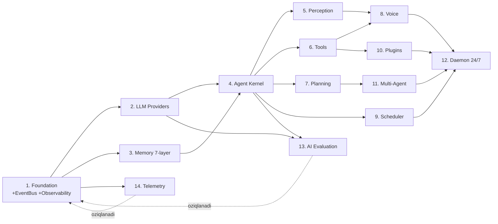

# DODA Agent — Roadmap (modul-ba-modul) · v3 · 14 modul

> Qoida: **bir modul tugab, review+test+doc+refactor'дан o'tгач keyingisiga.** Har modul
> mustaqil **vertical slice**, **production-ready** (vaqtinchalik kod/quick-fix YO'Q), eski
> v1.0.0 ni buzmaydi. Arxitektura — [ARCHITECTURE.md](ARCHITECTURE.md) · Standartlar — [`../docs/ENGINEERING_STANDARDS.md`](../docs/ENGINEERING_STANDARDS.md).

## Bog'liqlik grafi

## Bosqichlar (14 modul)

| # | Modul | Nima quriladi | Definition of Done |
|---|-------|---------------|--------------------|
| **1** | **Foundation** 🏗️ | Barcha portlar (EventBus/Observability/SecretStore ham), modellar (Event/Plan ham), `config`, `container` (DI), lokal asyncio **EventBus**, **Observability** skeleti (log/metric/trace/health hooks), **feature-flags**, **contract-test** ramkasi | Portlar import, config yuklaydi, EventBus pub/sub, `pytest`+`mypy`+`ruff` o'tadi |
| **2** | **LLM Providers** 🧠 | `ClaudeProvider` (async chat+tools+vision+stream) + registry; **capabilities** (vision/stream/tools flaglari); **fallback zanjiri** + circuit-breaker; **token/cost hisoblagich** (M13/M14 uchun hook); Gemini/OpenAI/Ollama/LMStudio/OpenRouter stub | Claude real javob; registry+fallback ishlaydi; token/cost qayd etiladi |
| **3** | **Memory (7-layer)** 🗄️ | `sqlite_store` (SQLModel), `embeddings`, `MemoryManager` (Recall/Consolidate/Forget), 7 qatlam | Fakt saqlaydi; semantik search; profil inject; keyingi sessiya eslaydi |
| **4** | **Agent Kernel** 🎯 | Kognitiv tsikl (Recall→Act→Reflect), `conversation`, `persona` (**versiyalangan prompt**); Event Bus'га ulanган | Persona+xotira bilan suhbat, tool chaqiradi, eventlar oqadi |
| **5** | **Perception** 👁️ | `VisionProvider` (mac+base; usb/rtsp/ip/screen stub), `EnvSensor` (clipboard/time/active-window/weather/calendar), `perception.*` | "Nima ko'ryapsan?"; env-kontekst oqadi; kamera config'дан almashadi |
| **6** | **Tools** 🧰 | `registry` + Terminal/Files/Clipboard/Notification/Weather/Calendar/Browser; **idempotency** | AI tool bilan real ish (sandbox+tasdiq); `tool.*` eventlar |
| **7** | **Planning Engine** 🎯 | `Planner/Executor/Verifier`; goal→subtask→execute→verify→retry | Murakkab goal reja bilan bajariladi, xatoда replan |
| **8** | **Voice** 🎙️ | `WakeWordDetector`, STT/TTS providerlar, `voice_loop` | "DODA"→tinglaydi→agent→ovoz; `voice.state` |
| **9** | **Scheduler** ⏰ | APScheduler + `create_task` tool + `task.*` | "Ertaga eslat/har juma backup" o'z vaqtida |
| **10** | **Plugins** 🔌 | `PluginLoader` (**hot-reload**/permission/version), `doda.sdk`, Telegram/Web **plugin sifatida** | Papka tashlab qo'shiladi; core tegilmaydi; restartsiz enable/disable |
| **11** | **Multi-Agent** 🤖 | `Orchestrator`+`Agent` interfeysi; Coding/Vision/Research (dastlab MainAgent) | Orchestrator goal'ни mos agentга; yangi agent core'siz |
| **12** | **Daemon 24/7** ♾️ | `daemon.py` async orchestrator, OS-service, eski servis migratsiyasi | Bitta jarayon hammasini parallel; boot autostart; v1.0.0 almashtiriladi |
| **13** | **AI Evaluation** 🎯 | Prompt versioning · response-eval · regression-test · benchmark · sifat-metrikalari · cost/token · latency · prompt-tarix · **AI performance dashboard** | Har javob baholanadi; model almashса sifat taqqoslanadi (Claude↔Gemini) |
| **14** | **Telemetry & Analytics** 📈 | CPU/RAM/Disk · API-calls · token/cost · tool/plugin statistikasi · crash/error · health · perf-metrikalari · **monitoring dashboard** | DODA o'z faoliyatini kuzatadi; `/status` + dashboard'да ko'rinadi |

> **Eslatma:** M13/M14 to'liq subsistemalar sifatida oxirда quriladi, LEKIN hook'lari boshиданоq
> laid: cost/token (M2), metric/trace/health (M1). "Monitoring boshidан ko'zда tutilган".

## Track B (Desktop/Mobile — Flutter) — parallel
D1 Flutter scaffold (desktop+mobile) → D2 API/IPC klient (WebSocket+HTTP) → D3 tray+autostart+lifecycle →
D4 Settings (device/keys/config) → D5 Python PyInstaller sidecar + OS-service → D6 installerlar
(DMG/MSI/AppImage/DEB) → D7 auto-update → D8 CI/CD (GitHub Actions) → D9 Plugin Store.
Batafsil — [`../desktop/DESKTOP_ARCHITECTURE.md`](../desktop/DESKTOP_ARCHITECTURE.md). A-Modul 4'дан keyin mazmunли.

## Har modul yakuni (majburiy)
**1) Code Review → 2) Test (unit+integration+contract) → 3) Documentation → 4) Refactoring → keyin keyingi modul.**
Feature'дан ko'ra kod sifati ustuvor.

## Migratsiya
Eski flat-koddan mantiq **ko'chiriladi+tozalanadi** (nusxa emas); v1.0.0 servislari M12'gача to'xtatilmaydi.

## Ochiq qarorlar (tegishli modulда)
Embeddings manbai (M3) · SQLite↔Postgres (M3) · Wake-engine (M8) · External broker (post-M12) · gRPC (kelajak).

## Keyingi qadam
➡️ Review tasdiqlangач **Modul 1 — Foundation** (portlar + EventBus + Observability + config + DI + contract-test + feature-flags).
